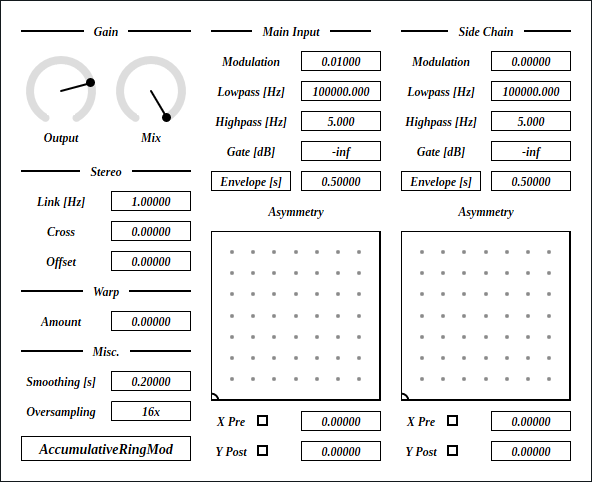

---
lang: ja
...

# AccumulativeRingMod

<ruby>AccumulativeRingMod<rt>アキュミュレーティブ リング モッド</rt></ruby> は入力信号の振幅を積算した値を位相として使うリングモジュレータです。サイン波のようなシンプルな波形にかけると FM のような音がでます。


- [AccumulativeRingMod {{ latest_version["AccumulativeRingMod"] }} `{{ target }}` - VST 3 をダウンロード (github.com)]({{ download_url }}) 


- [プリセットをダウンロード (github.com)]({{ preset_download_url["AccumulativeRingMod"] }})


{{ section["package"] }}

{{ section["contact_installation_guiconfig"] }}

## 操作
{{ section["gui_common"] }}

{{ section["gui_knob"] }}

## 注意
一部の DAW では、サイドチェーン入力がルーティングされていないとき、メイン入力がサイドチェーン入力に送られます。

## 使い方
AccumulativeRingMod はサイン波やのこぎり波などの波形が単純な音に変化をつけることが得意です。録音した楽器の音などにかけるときは `Modulation` と Warp -> `Amount` を低めにすることを推奨します。

外部のエンベロープジェネレータや LFO によって `Modulation` や Warp -> `Amount` をオートメーションすることで面白い変化をつけることができます。また、入力信号の振幅に応じて変調量が変わるので、時間とともに音量が変わる音と組み合わせることもお勧めです。

既にミックスされたドラムループなどの一部の音に応じて変調をかけたい、例えばスネアの音が鳴ったときだけ音が変わってほしい、というときは以下の手順を試してみてください。

1. `Lowpass` と `Highpass` を変えて変調に使いたい音の帯域だけを切り取る。
2. `Gate` を上げて使いたい音以外の部分が無音となるようにする。
3. `Envelope` を有効にして質感を整える。

## ブロック線図
図が小さいときはブラウザのショートカット <kbd>Ctrl</kbd> + <kbd>マウスホイール</kbd> や、右クリックから「画像だけを表示」などで拡大できます。

図で示されているのは大まかな信号の流れです。実装と厳密に対応しているわけではないので注意してください。

## パラメータ
角かっこ \[\] で囲まれているのは単位です。以下は単位の一覧です。

- \[dB\] : デシベル (decibel) 。
- \[s\] : 秒 (second) 。
- \[Hz\] : 周波数 (Hertz) 。

### Gain
Output

:   出力ゲインです。

Mix

:   入出力の混合比です。

### Stereo
Link \[Hz\]

:   左右のリングモジュレータの位相を同期するために使われる、ローパスフィルタのカットオフ周波数です。

    左右のチャンネルに異なる信号が入力されると、リングモジュレータの位相がずれた状態になります。そして位相がずれた状態で左右に同じ信号が入力されるとステレオの広がりが出てしまいます。このステレオの広がりを抑えたいときに `Link` が使えます。

    `Link` の値が大きいほど素早く、小さいほど緩やかに同期します。 `Link` が 0 のときは同期を行いません。

Cross

:   出力信号のステレオの左右を反転させる割合です。

    `Cross` が 0 のときはそのまま、 0.5 のときは左右が均等に混ざった状態、 1 のときは左右が完全に入れ替わった状態になります。

Offset

:   左右のリングモジュレータの位相のずれです。

    ステレオの広がりを出したいときに使えます。

### Warp
Amount

:   リングモジュレータの位相を歪ませる量です。

    Warp -> `Amount` が 0 でないときだけ CPU 負荷が上がるので注意してください。

### Misc.
Smoothing \[s\]

:   パラメータが変更されたときに、変更先の値に到達するまでにかかる大まかな時間です。

Oversampling

:   オーバーサンプリングの倍率です。

    オーバーサンプリングの倍率を上げると、 `Modulation` の値が大きいときに乗る、ざらざらとしたノイズが抑えられることがあります。ただし CPU 負荷は倍率に応じて上がります。

### Main Input, Side Chain
AccumulativeRingMod ではメインの入力とサイドチェイン入力それぞれで独立してパラメータを設定できます。

Modulation

:   変調の強さです。

Lowpass \[Hz\]

:   変調信号が通るローパスフィルタのカットオフ周波数です。

Highpass \[Hz\]

:   変調信号が通るハイパスフィルタのカットオフ周波数です。

Gate \[dB\]

:   変調信号が通るゲートのしきい値です。

    フィルタを通過した後の変調信号の振幅が `Gate` の値を下回ると、変調が止まります。

Envelope \[s\]

:   左側のボタンが点灯しているときは変調信号を通すことができるエンベロープフォロワが有効になります。右側はリリース時間です。

Asymmetry - X Pre

:   フィルタの通過前に、そのままの変調信号と、全波整流した変調信号を混ぜる比率です。

Asymmetry - Y Post

:   フィルタの通過後に、そのままの変調信号と、全波整流した変調信号を混ぜる比率です。

## チェンジログ

- {{version}}
  
  - {{ log }}
  


## 旧バージョン

旧バージョンはありません。

  
- [AccumulativeRingMod {{ x["version"] }} - VST 3 (github.com)]({{ x["url"] }})
  


## ライセンス
AccumulativeRingMod のライセンスは GPLv3 です。 GPLv3 の詳細と、利用したライブラリのライセンスは次のリンクにまとめています。

- [https://github.com/ryukau/VSTPlugins/tree/master/License](https://github.com/ryukau/VSTPlugins/tree/master/License)

リンクが切れているときは `ryukau@gmail.com` にメールを送ってください。

### VST® について
VST is a trademark of Steinberg Media Technologies GmbH, registered in Europe and other countries.
