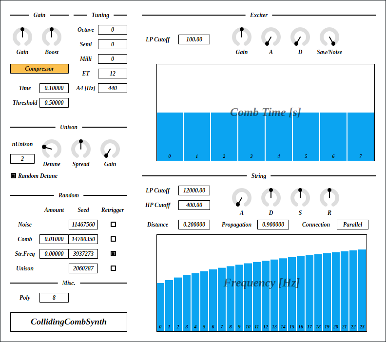

---
lang: ja
...

# CollidingCombSynth


<ruby>CollidingCombSynth<rt>コライディング コム シンセ</rt></ruby> は Karplus-Strong アルゴリズムによる弦の物理モデルをぶつけることで、弦を擦ったときのような音が出る実験的なシンセサイザです。音程はでますがチューニングが難しいので、どちらかと言うと効果音に向いています。

- [CollidingCombSynth {{ latest_version["CollidingCombSynth"] }} をダウンロード - VST® 3 (github.com)]({{ latest_download_url["CollidingCombSynth"] }}) 

- [プリセットをダウンロード (github.com)]({{ preset_download_url["CollidingCombSynth"] }})


パッケージには次のビルドが含まれています。

- Windows 64bit
- Linux 64bit
- macOS universal binary

Linux ビルドは Ubuntu 20.04 でビルドしています。もし Ubuntu 20.04 以外のディストリビューションを使っているときは、プラグインが読み込まれないなどの不具合が起こることがあります。この場合は[ビルド手順](https://github.com/ryukau/VSTPlugins/blob/master/build_instruction.md)に沿ってソースコードからビルドしてください。

{{ section["contact_installation_guiconfig"] }}

## 操作
{{ section["gui_common"] }}

{{ section["gui_knob"] }}

{{ section["gui_barbox"] }}

## 注意
`Compressor` を有効にしていても音量の変化が激しいので、 CollidingCombSynth の後に必ずリミッタを挿入することをお勧めします。

## ブロック線図
図が小さいときはブラウザのショートカット <kbd>Ctrl</kbd> + <kbd>マウスホイール</kbd> や、右クリックから「画像だけを表示」などで拡大できます。

図で示されているのは大まかな信号の流れです。実装と厳密に対応しているわけではないので注意してください。


## パラメータ
### Gain
Gain, Boost

:   出力音量です。 `Gain` の値と `Boost` の値は掛け合わされます。

    ```
    masterGain = Gain * Boost
    ```

Compressor

:   ボイスごとに用意されたコンプレッサを有効・無効にします。

Time

:   コンプレッサのアタック・リリース時間です。

    `Time` の音を大きくするほうが自然な聞こえ方に近くなりますが、音量のピークが抑えきれないときがあります。このときは `Threshold` の値を下げてみてください。

Threshold

:   コンプレッサが動作を始める音量です。通常は 1.0 以下に設定することをお勧めします。

### Tuning
Octave, Semi, Milli

:   全体の音の高さを変更します。

    - `Octave`: オクターブ
    - `Semi`: 半音
    - `Milli`: 半音の 1 / 1000 。 1 / 10 セント。

ET, A4 [Hz]

:   音律を変更します。

    `ET` は Equal Temperament (平均律) の略です。 `ET` が 12 のときは 12 平均律となります。 `ET` を 12 よりも小さくすると無音になる範囲が増えるので注意してください。

    `A4 [Hz]` は、音程 A4 の周波数です。

### Unison
nUnison

:   ユニゾンに使うボイスの数です。

    `Misc.` の `Poly` を増やすことで `nUnison` が大きいときに起こるリリースの途切れを減らすことができますが、引き換えに動作が重くなります。

Detune, Random Detune

:   `Detune` はユニゾンに使われているボイスのピッチをずらす量です。

    `Random Detune` のチェックを入れると、ピッチがずれる量がノートオンごとにランダムに変わるようになります。

    ```
    random = RandomDetune ? rand() : 1
    detune = pitch * (1 + random * unisonIndex * Detune)
    ```

Spread

:   ユニゾンの左右の広がりの量です。

Gain

:   ユニゾンに使われているボイスの音量をランダムに変更する量です。

### Random
4 つの乱数生成器の設定です。

- Noise: エキサイタ (exciter) のガウシアンノイズを生成する乱数です。
- Comb: エキサイタの `Comb Time` をランダマイズする乱数です。
- Str.Freq: `String` セクションの `Frequency` をランダマイズする乱数です。
- Unison: `Unison` セクションの `Detune` と `Gain` パラメータで使われる乱数です。

Amount

:   ランダマイズの度合いです。 0 のときはランダマイズが無効になります。

Seed

:   乱数列のシード値です。この値を変えると生成される乱数列が変わります。

Retrigger

:   チェックを入れるとノートオンのたびにシード値を設定しなおして、同じ乱数列を使用します。

### Exciter
物理モデルを励起 (excite) する信号の設定です。例えばギターのピッキング、ピアノの弦とハンマーの衝突、太鼓の打面とばちの衝突などが励起にあたります。

CollidingCombSynth のエキサイタは鋸歯波・ノイズオシレータの出力を、直列につないだ 8 個のコムフィルタに通しています。

LP Cutoff

:   オシレータ出力にかけるローパスフィルタのカットオフ周波数です。表示される値の単位は Hz です。

Gain

:   オシレータの音量です。

A, D

:   `A` はオシレータのアタック時間 (attack) 、 `D` はオシレータのディケイ時間 (decay) です。

    `A` を右に回すことでアタックが緩やかな音が作れます。

Saw/Noise

:   鋸歯波 (saw) オシレータとガウシアンノイズのミックスの比率です。左いっぱいに回すと鋸歯波のみ、右いっぱいに回すとノイズのみが出力されます。

Comb Time

:   オシレータから出力された信号が通るコムフィルタの時間です。表示される値の単位は秒です。

### String
Karplus-Strong アルゴリズムによる弦の設定です。

LP Cutoff

:   各弦のフィードバックに用意されたローパスフィルタのカットオフ周波数です。表示される値の単位は Hz です。

HP Cutoff

:   各弦の出力にかけるハイパスフィルタのカットオフ周波数です。表示される値の単位は Hz です。

Distance

:   隣り合う弦の間の距離です。 1 つの弦の出力の瞬時値が `Distance` を超えると、超えた音量が隣の弦に伝わります。

Propagation

:   弦が衝突したときに失う力を調整します。値が小さいほど衝突後の跳ね返りが弱くなります。

Connection

:   弦のつなげ方です。

    - `Parallel`: 弦を並列につなぎます。励起信号は 0 番目の弦から順に、衝突後の跳ね返りを加えつつ順に入力されます。
    - `Serial`: 弦を直列につなぎます。励起信号は 0 番目の弦にだけに入力されます。あとは N 番目の弦の出力が N + 1 番目の弦へと衝突を繰り返しながら伝わっていきます。 `Parallel` に比べると音量の変化がより激しくなるので、 `Compressor` をオフにするときは注意してください。

A, D, S, R

:   `LP Cutoff` を変調するエンベロープのパラメータです。実質的に音量エンベロープと似たような働きをします。

    - `A` (Attack) : 鍵盤を押した瞬間から `LP Cutoff` の値に到達するまでのアタック時間。
    - `D` (Decay) : `LP Cutoff` の値から `(LP Cutoff) * S` の値になるまでのディケイ時間。
    - `S` (Sustain) : アタックとディケイが終わった後に鍵盤を押し続けているときのサステインの大きさ。
    - `R` (Release) : 鍵盤から指を離したあとにカットオフ周波数が 0 になるまでのリリース時間。

Frequency

:   弦の基本周波数です。弦の最終的な周波数は音程と `Frequency` を掛け合わせた値になります。

    ```
    noteFrequency = A4Hz * pow(2, Octave + (Semi - 69) / ET + Milli / (ET * 1000))
    stringFrequency = Frequency * noteFrequency
    ```

## チェンジログ

- {{version}}
  
  - {{ log }}
  


## 旧バージョン

旧バージョンはありません。

  
- [CollidingCombSynth {{ x["version"] }} - VST 3 (github.com)]({{ x["url"] }})
  


## ライセンス
CollidingCombSynth のライセンスは GPLv3 です。 GPLv3 の詳細と、利用したライブラリのライセンスは次のリンクにまとめています。

- [https://github.com/ryukau/VSTPlugins/tree/master/License](https://github.com/ryukau/VSTPlugins/tree/master/License)

リンクが切れているときは `ryukau@gmail.com` にメールを送ってください。

### VST® について
VST is a trademark of Steinberg Media Technologies GmbH, registered in Europe and other countries.
