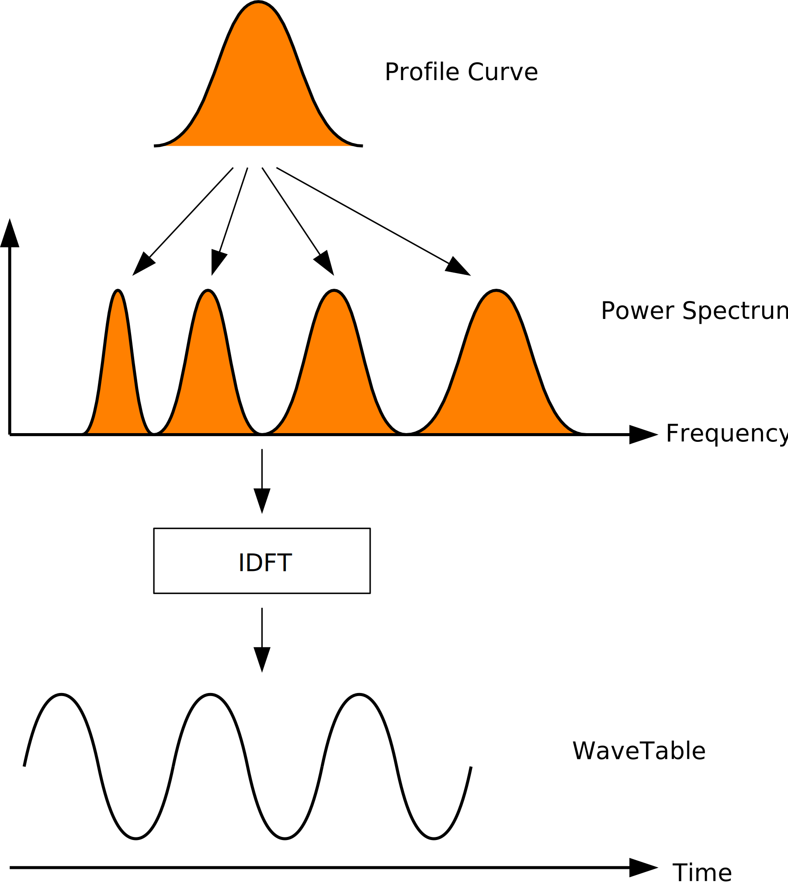

---
lang: ja
...

# CubicPadSynth


<ruby>CubicPadSynth<rt>キュービック パッドシンセ</rt></ruby> は PADsynth アルゴリズムを使ってオシレータのウェーブテーブルを生成するシンセサイザです。キュービック補間を使っているので、可聴域以下の低い周波数でもわりと滑らかな音が出ます。波形を直接描画できる LFO もついています

- [CubicPadSynth {{ latest_version["CubicPadSynth"] }} をダウンロード - VST® 3 (github.com)]({{ latest_download_url["CubicPadSynth"] }}) 

- [プリセットをダウンロード (github.com)]({{ preset_download_url["CubicPadSynth"] }})


CubicPadSynth を使うには CPU が AVX 以降の SIMD 命令セットをサポートしている必要があります。

パッケージには次のビルドが含まれています。

- Windows 64bit
- Linux 64bit

{{ section["macos_warning"] }}

Linux ビルドは Ubuntu 20.04 でビルドしています。もし Ubuntu 20.04 以外のディストリビューションを使っているときは、プラグインが読み込まれないなどの不具合が起こることがあります。この場合は[ビルド手順](https://github.com/ryukau/VSTPlugins/blob/master/build_instruction.md)に沿ってソースコードからビルドしてください。

{{ section["contact_installation_guiconfig"] }}

## 操作
{{ section["gui_common"] }}

{{ section["gui_knob"] }}

{{ section["gui_barbox"] }}

## 注意
`Refresh LFO` あるいは `Refresh Table` ボタンを押すと音が止まります。発音中のノートも全て停止します。

## ウェーブテーブルの仕様
1 つのウェーブテーブルの長さは `2^18` サンプルです。

各 MIDI ノートと 20000Hz までのピッチベンドができるように帯域制限された 136 のウェーブテーブルが生成されます。約 21100 Hz より音程が高くなると完全な無音になります。 21100 は MIDI ノート番号 136 から求められた値です。 MIDI ノート番号 137 の周波数は 22050 Hz よりも高いので、サンプリング周波数が 44100 Hz のときにエイリアシングが起こります。したがって一つ小さい 136 を使っています。

音程の基本周波数が 8.18 Hz (MIDI ノート番号 0) より低くなると高域の周波数成分が失われた音になります。ただし、キュービック補間によって生じるノイズによって、周波数成分の値が完全に 0 にはならないことがあります。

```
noteToFreq(note) := 440 * pow(2, (note - 69) / 12)
noteToFreq(0) = 8.175798915643707
noteToFreq(136) = 21096.16364242367
noteToFreq(137) = 22350.606811712252
```

ウェーブテーブルは `136 * 2^18` の 2 次元配列として表現されています。オシレータの位相と周波数から求められるテーブル上の座標についてバイキュービック補間で値を求めています。

ウェーブテーブルが大きめなので、メモリが遅いとフレーム落ち ([xrun](https://alsa.opensrc.org/Xruns)) の可能性が高まります。音程が高くなるほどアクセスパターンがランダムに近くなるので、環境によっては重くなります。

- [Alsa Opensrc Org - Independent ALSA and linux audio support site](https://alsa.opensrc.org/Xruns)
- [linux - What are XRuns? - Unix & Linux Stack Exchange](https://unix.stackexchange.com/questions/199498/what-are-xruns)

## PADsynth アルゴリズムの概要
CubicPadSynth は [ZynAddSubFX](https://zynaddsubfx.sourceforge.io/) や [Yoshimi](http://yoshimi.sourceforge.net/) で使われている PADsynth アルゴリズムでウェーブテーブルを合成しています。

適当に位相をランダマイズした周波数成分を逆 DFT すると一方の端ともう一方の端が滑らかにつながった周期的な波形になります。PADsynth アルゴリズムはこの性質を使って滑らかにループするウェーブテーブルを合成します。

周波数成分の合成ではプロファイルと呼ばれている適当な関数をスペクトラム上に並べます。 CubicPadSynth のプロファイルはオリジナルの PADsynth アルゴリズムと同じ正規分布曲線を使っています。プロファイルの中心となる周波数は任意に決めることができます。 CubicPadSynth ではデフォルトで `Base Freq.` で指定した基本周波数とその倍音にあたる周波数を使います。



- [PADsynth algorithm](https://zynaddsubfx.sourceforge.io/doc/PADsynth/PADsynth.htm)

## ブロック線図
図が小さいときはブラウザのショートカット <kbd>Ctrl</kbd> + <kbd>マウスホイール</kbd> や、右クリックから「画像だけを表示」などで拡大できます。

図で示されているのは大まかな信号の流れです。実装と厳密に対応しているわけではないので注意してください。


## パラメータ
### Main タブ


#### Tuning
Octave, Semi, Milli

:   全体の音の高さを変更します。

    - `Octave`: オクターブ
    - `Semi`: 半音
    - `Milli`: 半音の 1 / 1000 。 1 / 10 セント。

ET, A4 [Hz]

:   音律を変更します。

    `ET` は Equal Temperament (平均律) の略です。 `ET` が 12 のときは 12 平均律となります。 `ET` を 12 よりも小さくすると無音になる範囲が増えるので注意してください。

    `A4 [Hz]` は、音程 A4 の周波数です。

#### Gain
A, D, S, R

:   音量エンベロープのパラメータです。

    - `A` (Attack) : 鍵盤を押した瞬間から最大音量になるまでのアタック時間。
    - `D` (Decay) : 最大音量からサステイン音量になるまでのディケイ時間。
    - `S` (Sustain) : アタックとディケイが終わった後に鍵盤を押し続けているときのサステイン音量。
    - `R` (Release) : 鍵盤から指を離したあとに音量が 0 になるまでのリリース時間。

Gain

:   音量を変更します。

#### Lowpass
現在の音程よりも倍音の少ないウェーブテーブルを使うことで疑似的にローパスフィルタを再現しています。

カットオフ周波数の計算式は次のようになっています。

```
cut = Cutoff * 128
keyFollowRange = Cutoff * (nTable - pitch)
lowpassPitch = (cut + KeyFollow * (keyFollowRange - cut)) - lowpassEnvelope * Amount;
if (lowpassPitch < 0) lowpassPitch = 0

noteToFreq(note) := 440 * Math.pow(2, (note - 69) / 12)
range  = noteToFreq(nTable)
lpFreq = noteToFreq(midiNote + lowpassPitch)
ntFreq = noteToFreq(midiNote)
cutoffFrequency = (1 + (range - lpFreq) / range) * ntFreq
```

`lpCut` の計算に使っている 128 は MIDI ノート番号の範囲 + 1 から適当に決めた値です。また `nTable = 136` です。

Cutoff

:   フィルタのカットオフ周波数を変更します。

KeyFollow

:   右いっぱいに回すと音程に関わらず倍音の数がだいたい等しくなるようにカットオフ周波数を調節します。左いっぱいに回すと音程に関わらず `Cutoff` で設定されたカットオフ周波数を使います。

A, D, S, R, Amount

:   フィルタのカットオフ周波数を変調するエンベロープのパラメータです。 `Amount` は `Cutoff` への変調量です。

#### Pitch
A, D, S, R, Amount

:   ノートごとにピッチを変調するエンベロープのパラメータです。

Negative

:   エンベロープの符号を反転します。

#### Unison
nUnison

:   ユニゾンに使うボイスの数です。

    `Misc.` の `nVoice` を増やすことで `nUnison` が大きいときに起こるリリースの途切れを減らすことができますが、引き換えに動作が重くなります。

Detune, Random Detune

:   `Detune` はユニゾンに使われているボイスのピッチをずらす量です。

    `Random Detune` のチェックを入れると、ピッチがずれる量がノートオンごとにランダムに変わるようになります。

    ```
    random = RandomDetune ? rand() : 1
    detune = pitch * (1 + random * unisonIndex * Detune)
    ```

GainRnd

:   ユニゾンに使われているボイスの音量をランダムに変更する量です。

Phase

:   ユニゾンに使われているボイスの位相をランダムに変更する量です。

    Phase セクションの `Reset` にチェックが入っていないとき、この値は無視されます。

Spread, Spread Type

:   `Spread` はユニゾンの左右の広がりの量です。

    `Spread Type` でボイスのピッチに応じたパンの割り当て方を選択できます。

    - `Alternate L-R`: `Ascend L -> R` と `Ascend R -> L` を交互に変更。
    - `Alternate M-S`: `HighOnMid` と `HighOnSide` を交互に変更。
    - `Ascend L -> R`: 左から右に向かってピッチが上昇。
    - `Ascend R -> L`: 右から左に向かってピッチが上昇。
    - `HighOnMid`: 端から中央に向かってピッチが上昇。
    - `HighOnSide`: 中央から端に向かってピッチが上昇。
    - `Random`: ランダムに生成したパンを割り当て。偏ることがあります。
    - `RotateL`: ノートオンごとに割り当てを左に回転。
    - `RotateR`: ノートオンごとに割り当てを右に回転。
    - `Shuffle`: 均一に並べたパンをランダムに割り当て。

#### LFO
Refresh LFO

:   現在の `LFO Wave` のパラメータに基づいて LFO のウェーブテーブルを更新します。

    ウェーブテーブルの更新中は音が止まるので注意してください。発音中のノートも全て停止します。

Interpolation

:   LFO のウェーブテーブルの補間の種類です。

    

Tempo, Multiply

:   LFO の周波数をテンポに応じた形で指定します。 `Tempo` の下の数字が音符の長さ、上の数字が音符の数です。例えば上が 6 、下が 8 なら 8 分音符の 6 個分の長さが LFO の 1 周期になります (6 / 8 拍子)。

    `Multiply` は `Tempo` から計算された周波数に掛け合わされる値です。

    ```
    // (60 秒) * (4 拍子) = 240 。
    lfoFrequency = Multiply * (BPM / 240) / (TempoUpperNumeral / TempoLowerNumeral)
    ```

Retrigger

:   チェックを入れると、ノートオンごとに LFO の位相をリセットします。

Amount

:   LFO でピッチを変調する量です。

Lowpass

:   LFO にかけるローパスフィルタのカットオフ周波数を変更します。

LFO Wave

:   LFO の波形です。

#### Phase
Phase

:   オシレータの初期位相です。

Reset

:   チェックを入れると、ノートオンのたびにオシレータの位相を `Phase` で指定した値にリセットします。

Random

:   チェックを入れると、ノートオンごとに位相をランダマイズします。 `Phase` で指定した値がランダマイズの範囲になります。

#### Misc.
Smooth

:   特定の値を変更したときに、変更前の値から変更後の値に移行する時間（秒）です。

    `Smooth` と関連するパラメータのリストです。 `*` はワイルドカードです。

    - Tuning セクションの全て
    - Gain
      - `S`
      - `Gain`
    - Lowpass
      - `Cutoff`
      - `KeyFollow`
      - `S`
      - `Amount`
    - Pitch
      - `S`
      - `Amount`
      - `Negative`
    - LFO
      - `Tempo`
      - `Multiply`
      - `Amount`
      - `Lowpass`
    - Phase
      - `Phase`

nVoice

:   最大同時発音数です。

Pool

:   チェックを入れると、現在の発音数が同時最大発音数に近づいたときに、音量の最も小さいボイスをリリースします。ノートオン時に生じるプチノイズの低減に使えます。

### Wavetable タブ


#### 倍音コントロール
Gain

:   プロファイルの高さです。

Width

:   プロファイルの幅です。

Pitch

:   プロファイルの周波数にかけ合わせる値です。

Phase

:   プロファイルの位相をランダマイズする量です。

#### Pitch
Base Freq.

:   ウェーブテーブルのレンダリング時の基本周波数です。この値が小さいとマスターピッチのチューニングが狂うことがあるので注意してください。

Multiply, Modulo

:   プロファイルの周波数を変更します。

    ```
    profileFrequency = mod(
      BaseFreq * profileIndex * overtonePitch * Multiply,
      440 * pow(2, (Modulo - 69) / 12)
    )
    ```

Random

:   チェックを入れると、倍音コントロールの `Pitch` で指定された値を無視して、プロファイルの周波数をランダマイズします。

#### Spectrum
Expand

:   スペクトラムを周波数軸に沿って拡大・縮小するスケーリング係数です。

    

Shift

:   スペクトラムを左右にシフトする量です。

    

Comb

:   `Comb` の値が 1 以上のとき、プロファイルをくし状に変形します。値はくしのすき間の間隔です。

    

Shape

:   `Shape` の値を指数として、プロファイルの形をべき乗によって変更します。

    ```
    shapedProfile = powf(profile, shape);
    ```

Invert

:   スペクトラムの絶対値の最大値が 0 、 0 が絶対値の最大値になるように反転します。符号は保持されます。位相は考慮していません。

    ```
    maxRe = max(abs(spectrumRe))
    maxIm = max(abs(spectrumIm))
    invertedSpectrumRe = spectrumRe - sgn(spectrumRe) * maxRe
    invertedSpectrumIm = spectrumIm - sgn(spectrumIm) * maxIm
    ```

#### Phase
UniformPhase

:   チェックを入れると、プロファイル内での位相を均一にします。

#### Random
Seed

:   乱数のシード値です。この値を変えると生成される乱数が変わります。

#### Modifier
Gain^

:   倍音コントロールの `Gain` をべき乗する値です。

    ```
    profileGain = pow(Gain, Gain^)
    ```

Width\*

:   倍音コントロールの `Width` にかけ合わせる値です。

    ```
    profileWidth = Width * (Width*)
    ```

#### Refresh Table
現在の Wavetable タブのパラメータに基づいてオシレータのウェーブテーブルを更新します。

ウェーブテーブルの更新中は音が止まるので注意してください。発音中のノートも全て停止します。

## チェンジログ

- {{version}}
  
  - {{ log }}
  


## 旧バージョン

旧バージョンはありません。

  
- [CubicPadSynth {{ x["version"] }} - VST 3 (github.com)]({{ x["url"] }})
  


## ライセンス
CubicPadSynth のライセンスは GPLv3 です。 GPLv3 の詳細と、利用したライブラリのライセンスは次のリンクにまとめています。リンクが切れているときは `ryukau@gmail.com` にメールを送ってください。

- [https://github.com/ryukau/VSTPlugins/tree/master/License](https://github.com/ryukau/VSTPlugins/tree/master/License)

### VST® について
VST is a trademark of Steinberg Media Technologies GmbH, registered in Europe and other countries.
