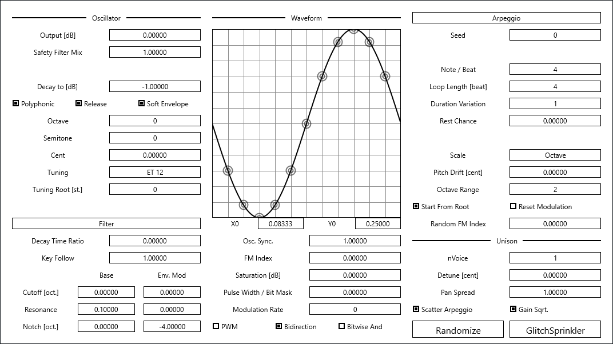
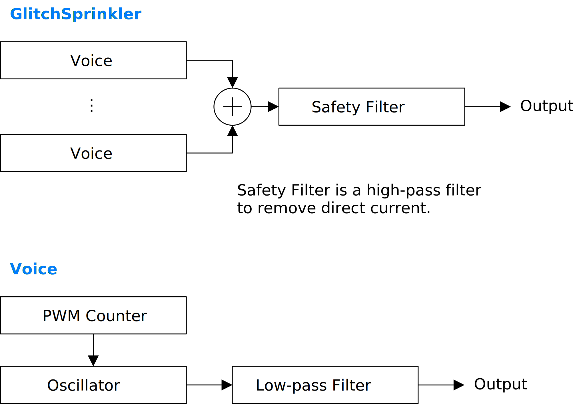

---
lang: ja
...

# GlitchSprinkler


<ruby>GlitchSprinkler<rt>グリッチ スプリンクラー</rt></ruby> は速いアルペジオに特化したシンセサイザです。オシレータの周期を整数のサンプル数のみとすることで安価にアンチエイリアシングを行っています。このアンチエイリアシングの副作用により、特に音程が高いときにピッチがずれて独特の音律が現れます。


- [GlitchSprinkler {{ latest_version["GlitchSprinkler"] }} `{{ target }}` - VST 3 をダウンロード (github.com)]({{ download_url }}) 


- [プリセットをダウンロード (github.com)]({{ preset_download_url["GlitchSprinkler"] }})


**注意**: プリセットはサンプリング周波数が 48000 Hz でなければ想定された音が出ません。

{{ section["package"] }}

{{ section["contact_installation_guiconfig"] }}

## 操作
{{ section["gui_common"] }}

{{ section["gui_knob"] }}

## 注意
音程が高くなるほどピッチがずれます。これは GlitchSprinkler で使われているアンチエイリアシングの副作用です。

直流が乗ります。 `Safety Filter Mix` を 1 にすると直流を切る -6 dB/oct のハイパスフィルタがかかります。音の開始時点での振幅の跳ね上がりが大きいときは、より切れ味の鋭い外部のハイパスフィルタを使ってください。

## MIDI チャンネル 16 について
MIDI チャンネル 16 のノートイベントは、通常のノートのように音が出ません。代わりに次に演奏する音程を変化させます。発音中のノートの周波数は変更されません。

音程の変化は、発音されるノートの周波数に MIDI チャンネル 16 で最後に演奏されたノート番号を乗算する形で行われます。つまり 0 以上の整数の倍音を演奏することができます。以下は計算式です。

```
noteFrequency = baseFrequency * lastNoteNumberOnChannel16;
```

## ブロック線図
図が小さいときはブラウザのショートカット <kbd>Ctrl</kbd> + <kbd>マウスホイール</kbd> や、右クリックから「画像だけを表示」などで拡大できます。

図で示されているのは大まかな信号の流れです。実装と厳密に対応しているわけではないので注意してください。



## パラメータ
角かっこ \[\] で囲まれているのは単位です。以下は単位の一覧です。

- \[beat\] : 拍数。
- \[dB\] : デシベル (decibel) 。
- \[oct\] : オクターブ (octave) 。
- \[st.\] : 半音 (semitone)。 1 半音は `1 / 12` オクターブ。
- \[cent\] : セント。 1 セントは `1 / 100` 半音。

### Oscillator
Output \[dB\]

:   出力ゲインです。

Safety Filter Mix

:   直接の出力と、ハイパスフィルタをかけた出力を混ぜる比率です。 1 のときにハイパスフィルタをかけた出力が 100% になります。

    このハイパスフィルタは -6 dB/oct の減衰を持ち、簡易に直流を取り除くために備えられています。直流が大きいときは音の開始時点（トランジエント）の部分に癖が残ることがあるので、より切れ味のいい外部のハイパスフィルタに切り替えることを推奨します。

    以下は信号の流れの概要です。

    ```
    hp = highpass(input);
    output = input + (Safety Filter Mix) * (hp - input);
    ```

Decay to \[dB\]

:   アルペジオのノート 1 つ分の時間でエンベロープが減衰する量です。

    アルペジオのノート 1 つ分の時間の時間は、 DAW で設定されたテンポと `Note / Beat` に依存します。以下は計算式です。

    ```
    samplesPerBeat = 60 * sampleRate / tempo;
    noteDurationInSamples = samplesPerBeat / (`Note / Beat`);
    ```

Polyphonic

:   コードを弾くときはオン、単旋律を弾くときはオフにしてください。

    オンにすると最大 256 音まで同時発音します。オフのときは `Unison` セクションの `nVoice` の数だけ同時発音します。

Release

:   オンにするとノートオフの後もエンベロープによる減衰が続きます。オフにするとノートオフの後に波形が 1 周するのを待ってから音を止めます。オフのときでも音程が低いとしばらく音が残ります。

    ピアノのサステインペダルと似たようなスイッチです。

Soft Envelope

:   エンベロープにスムーシングフィルタをかけて音の始まりと終わりに出るポップノイズを抑えます。

    ポップノイズは `Filter` がオンのときや、音程が低いときに、特に目立ちます。

Octave

:   オクターブ単位でのトランスポーズです。

Semitone

:   半音単位でのトランスポーズです。 `Tuning` によって半音の比率が変わります。

Cent

:   セント単位でのトランスポーズです。 `Semitone` とは異なり、 `Tuning` によらず 12 平均律の比率が使われます。以下は n セントの計算式です。

    ```
    ratio = 2^(n / 1200);
    ```

Tuning

:   音律です。

    - `ET N` : N 平均律。
    - `Just N` : N-limit 音律。
      - `Just 5 Major` : いわゆる純正律。 +4 半音のうなりを減らすように調整。
      - `Just 5 Minor` : いわゆる純正律。 +3 半音のうなりを減らすように調整。
    - `MT Pythagorean` : ピタゴラス音律。
    - `MT 1/3 Comma` : 1 / 3 コンマのミーントーン。
    - `MT 1/4 Comma` : 1 / 4 コンマのミーントーン。
    - Discrete N` : サンプリング周波数を `N` で割った周波数を中央周波数とする 12 平均律。

    `Discrete` の音律はサンプリング周波数によって大きくピッチが変わります。

    `Discrete 2` はサンプリング周波数が 48000 Hz のときに 1 半音上にトランスポーズすると `ET 12` と似たようなピッチになります。

Tuning Root \[st.\]

:   平均律でない音律のルートです。

    例えば以下のような 3 音の音律があるとします。

    ```
    [1, 5/4, 4/3]
    ```

    `Tuning Root` が 0 のときは上の比率をそのまま使います。

    `Tuning Root` が 1 のときは上の比率のリストを左に 1 だけシフトして、オクターブの巻き戻しをかけます。

    ```
       [           1,            5/4,         4/3]
    -> [         5/4,            4/3,           1] // 左シフト。
    -> [(5/4) / (4/5), (4/3) / (4/5), (1) / (4/5)] // 最も左の比率が 1 となるように調整。
    -> [            1,         16/15,         4/5]
    -> [            1,         16/15,         8/5] // オクターブの巻き戻し。
    ```

### Filter
レゾナンスのついた -6 dB/oct のローパスフィルタです。有効にすると CPU 負荷が増えるので注意してください。

フィルタの癖によってカットオフ周波数をいくら上げてもレゾナンスが fs / 6 付近より高くなりません。ここで fs はサンプリング周波数です。つまり、サンプリング周波数によってレゾナンスの質感が大きく変わります。

Decay Time Ratio \[dB\]

:   フィルタのエンベロープのディケイ時間です。 `Oscillator` セクションの `Decay to` からの比率として計算されます。

Key Follow

:   カットオフ周波数をノートの音程と合わせる度合いです

    `Cutoff` が 0 かつ `Key Follow` が 1 のとき、ノートの音程の周波数と、フィルタのエンベロープが減衰しきったときのカットオフ周波数が一致します。

    `Cutoff` が 0 かつ `Key Follow` が 0 のとき、フィルタのエンベロープが減衰しきったときのカットオフ周波数は 20 Hz になります。

    以下はフィルタのエンベロープが減衰しきったときのカットオフ周波数 (`adjustedCutoffHz`) の計算式です。

    ```
    baseCutoffHz = 20 + (Key Follow) * (freqHz - 20);
    adjustedCutoffHz = baseCutoffHz * 2^(Cutoff);
    ```

Cutoff \[oct.\]

:   フィルタのカットオフ周波数です。

Resonance

:   フィルタのレゾナンスです。

Notch \[oct.\]

:   フィルタによくわからない癖をつけます。

    この値はフィードバック経路に用意されたオールパスフィルタのカットオフ周波数を変更します。振幅特性を見るとノッチが現れるように見えます。またレゾナンスの強さも変わります。

### Waveform
GlitchSprinkler では、 `Pulse Width / Bit Mask` を除く波形のパラメータはノートオンの時点で固定されます。これは速いアルペジオの演奏でノイズを抑えるための意図的なチューニングです。

(Waveform Editor), Xn, Yn

:   多項式オシレータの制御点です。

    多項式近似の性質より波形がくねります。ランダマイズを優先して使い、人手による調整は避けることをお勧めします。

    以下はショートカットの一覧です。ショートカットは波形エディタを左クリックしてフォーカスすると有効になります。フォーカス後にマウスカーソルを波形エディタの領域外に移動させると、ショートカットが無効になります。右下のプラグイン名をクリックことでもショートカットの一覧を表示できます。

    | 入力         | 操作                      |
    |--------------|---------------------------|
    | <kbd>r</kbd> | ランダマイズ                    |
    | <kbd>t</kbd> | y 軸方向に少しだけランダマイズ      |
    | <kbd>0</kbd> | プリセット波形 : 無音 (横一列) |
    | <kbd>1</kbd> | プリセット波形 : サイン波         |
    | <kbd>2</kbd> | プリセット波形 : FM A          |
    | <kbd>3</kbd> | プリセット波形 : FM B          |
    | <kbd>4</kbd> | プリセット波形 : のこぎり波        |
    | <kbd>5</kbd> | プリセット波形 : 三角波        |
    | <kbd>6</kbd> | プリセット波形 : 台形          |
    | <kbd>7</kbd> | プリセット波形 : 交互          |
    | <kbd>8</kbd> | プリセット波形 : パルス           |
    | <kbd>9</kbd> | プリセット波形 : 歪んだサイン波     |

Osc. Sync.

:   ハードシンクの比率です。

FM Index

:   FM の強さです。

    FM の接続は 1 オペレータのフィードフォワードです。つまり、波形の多項式を 1 回計算したあと、得られた値を一時的に位相に加えて、もう一度多項式を計算しています。

Saturation \[dB\]

:   ハードクリッピングに波形を入力するときのゲインです。

    矩形波を作るときは `Saturation` の値を上げてください。

Pulse Width / Bit Mask

:   波形に乗算する矩形波のデューティ比です。

    `Bitwise And` がオンのときは矩形窓の乗算の代わりに、 `Pulse Width / Bit Mask` の値を基にした整数でオシレータの位相にビット論理積をかけます。

    **注意**: `Pulse Width / Bit Mask` が 1 かつ `PWM` がオフのとき、デューティ比が 0 となり音が止まります。

Modulation Rate

:   パルス幅変調 (PWM) の速さです。

    0 以上のときに変調が遅くなり、負の方向に進むほど変調が速くなります。

    ノートのピッチに応じて変調の速さが変わります。

PWM

:   オンにするとパルス幅変調 (PWM) をかけます。

    PWM は `Pulse Width / Bit Mask` が 1 に近いほど深くかかります。

Bidirectional

:   オンでは三角波、オフでは鋸歯波によって PWM が行われます。

    `PWM` がオフのときは効果がありません。

Bitwise And

:   オンにすると内部的に整数で表されているオシレータの位相に `Pulse Width / Bit Mask` を基にした別の整数でビット論理積をかけます。

    `Modulation Rate` が速いと波形の切り替わりで生じるノイズによってがさがさとした音になりがちです。

### Arpeggio
GlitchSprinkler は `Oscillator` セクションの `Polyphonic` と `Soft Envelope` をオフ、 `Unison` セクションの `nVoice` を 2 にして速いアルペジオを演奏することに特化して作られています。

Seed

:   乱数のシード値です。シード値が変わると旋律が変わります。

Note / Beat

:   アルペジオのノート 1 つの長さの最小値です。

    デフォルトの 4 では 1 拍あたりに 4 つのノートが演奏されます。つまり最小の長さは 16 分音符となります。

Loop Length \[beat\]

:   アルペジオが 1 周する長さです。

    0 のときは明示的には繰り返しませんが、実装の都合で 2^32 (≈ 4.3 億) 個のノートが演奏されるごとに 1 周します。

Duration Variation

:   アルペジオのノートの長さをランダマイズする幅です。

    例えば `Note / Beat` が 4 かつ、 `Duration Variation` が 3 のとき、ノートの長さが 1 / 16, 2 / 16, 3 / 16 の中からランダムに選ばれます。

Rest Chance

:   アルペジオに休符を挟む確率です。

    `Unison` セクションの `nVoice` が多いときに使うと雰囲気がでます。

    **注意**: 1 にすると 100% 休符となるため音が止まります。

Scale

:   アルペジオで使われる音程の組 (スケール) です。

Pitch Drift \[cent\]

:   ノートのピッチをランダマイズする量です。

Octave Range

:   アルペジオが使うオクターブの幅です。

    一部のスケールは 1 オクターブを超えるので、指定した値よりも広い幅で演奏されることがあります。

Start From Root

:   オンのとき、アルペジオの 1 つめの音程をノートオンで指定された音程にそろえます。

Reset Modulation

:   オンのとき、新しくノートが発音されるたびに PWM の位相をリセットします。

Random FM Index

:   新しくノートが発音されるたびに `FM Index` をランダマイズする比率です。

### Unison
nVoice

:   1 つのノートオンで同時に発音するボイス数です。

    値を大きくすると CPU 負荷が高くなります。特に `Release` がオンのときは注意してください。高い音程を演奏するときは少なめ、低い音程を演奏するときは多めに設定すると CPU 負荷の節約につながります。

Detune \[cent\]

:   ユニゾンに使うボイスのピッチをずらす量です。

Pan Spread

:   ユニゾンに使うボイスを左右に広げる量です。

Scatter Arpeggio

:   `Arpeggio` がオンのときのみ有効です。オンのときはボイスごとに異なる旋律を演奏します。オフのときはすべてのボイスで同じ旋律を演奏します。

Gain Sqrt.

:   `nVoice` に応じたゲインの調整方法を変更します。

    オンのときは 1 ボイスあたりのゲインを `sqrt(nVoice)` とします。オフのときは 1 ボイスあたりのゲインを `1 / (nVoice)` とします。

    オンにしたほうが自然に聞こえるので `nVoice` を変更するときに耳での比較がしやすいですが、ピーク振幅がかなり大きくなります。

## チェンジログ

- {{version}}
  
  - {{ log }}
  


## 旧バージョン

旧バージョンはありません。

  
- [GlitchSprinkler {{ x["version"] }} - VST 3 (github.com)]({{ x["url"] }})
  


## ライセンス
GlitchSprinkler のライセンスは GPLv3 です。 GPLv3 の詳細と、利用したライブラリのライセンスは次のリンクにまとめています。

- [https://github.com/ryukau/VSTPlugins/tree/master/License](https://github.com/ryukau/VSTPlugins/tree/master/License)

リンクが切れているときは `ryukau@gmail.com` にメールを送ってください。

### VST® について
VST is a trademark of Steinberg Media Technologies GmbH, registered in Europe and other countries.
