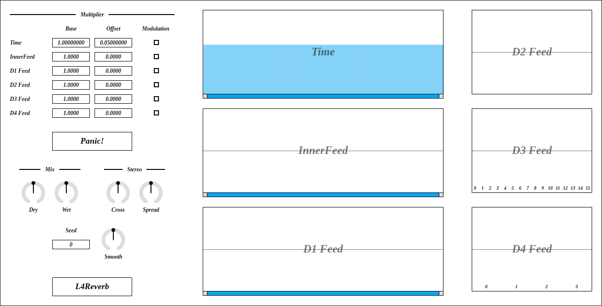

---
lang: en
...

# L4Reverb


L4Reverb is an extended version of LatticeReverb. This time, lattice structure has 4 * 4 * 4 * 4 = 256 sections per channel.

- [Download L4Reverb {{ latest_version["L4Reverb"] }} - VST® 3 (github.com)]({{ latest_download_url["L4Reverb"] }}) 

- [Download Presets (github.com)]({{ preset_download_url["L4Reverb"] }})


If L4Reverb is too heavy for your machine, L3Reverb is also available. L3Reverb is a trimmed down version of L4Reverb. The lattice structure has 3 * 3 * 3 * 5 = 135 sections per channel.

- [Download L3Reverb {{ latest_version["L3Reverb"] }} - VST® 3 (github.com)]({{ latest_download_url["L3Reverb"] }}) 

- [Download Presets (github.com)]({{ preset_download_url["L3Reverb"] }})


The package includes following builds:

- Windows 64bit
- Linux 64bit
- macOS universal binary

Linux build is built on Ubuntu 20.04. If you are using distribution other than Ubuntu 20.04, plugin will not likely to run. In this case, please take a look at [build instruction](https://github.com/ryukau/VSTPlugins/blob/master/build_instruction.md).

{{ section["contact_installation_guiconfig"] }}

## Controls
{{ section["gui_common"] }}

{{ section["gui_knob"] }}

{{ section["gui_barbox"] }}

## Caution
Output may change with different sample rate or buffer size.

Output may blow up when both `Cross` and `Spread` are not 0.

Output may become loud when `offset` of `*Feed` is not 0, and modulation is enabled.

Output may become loud when following steps are performed.

1. Set some of the `OuterFeed` or `InnerFeed` to close to minimum or maximum.
2. Input signals.
3. Change the value of `OuterFeed` or `InnerFeed` which was set at step 1.

## Block Diagram
If the image is small, use <kbd>Ctrl</kbd> + <kbd>Mouse Wheel</kbd> or "View Image" on right click menu to scale.

Diagram only shows overview. It's not exact implementation.


## Parameters

Time

:   Delay time of all-pass filter.

InnerFeed

:   Feedback and feedforward gain of all-pass filters nested inside of lattice structure.

D1Feed

:   Feedback and feedforward gain of lattice structure at lowest layer.

D2Feed

:   Feedback and feedforward gain of lattice structure at 2nd lowest layer.

D3Feed

:   Feedback and feedforward gain of lattice structure at 3rd lowest layer.

D3Feed

:   Feedback and feedforward gain of lattice structure at top layer.

**Tip**: Setting all of the `*Feed` values to negative makes output more wet by blurring  input signal. Especially recommend to fine tuning `D4Feed`.

### Multiplier
Multiplier for `Time` and `*Feed`. Useful to shorten or lengthen reverb.

`Base` values are used in both left and right channel. `Base` value determines the character of reverb.

`Offset` values are maximum ratio between left and right channel. Amount of ratio is randomized. Changing `Offset` spreads reverb to stereo.

```
if (Offset >= 0) {
  valueL = Base
  valueR = Base * (1 - Offset)
}
else {
  valueL = Base * (1 + Offset)
  valueR = Base
}
```

When `Modulation` is checked, `Offset` values will be randomized for each buffer. `Smooth` can be used to change the character of modulation.

### Panic!
Pressing `Panic!` button stops reverb output by setting multiplier of `Time` and `*Feed` to 0.

Useful to stop sounds in case of blow up.

### Mix
Dry

:   Gain of input signal.

Wet

:   Gain of reverb signal.

### Stereo
Cross

:   Feedback amount from an output of lattice structure to the lattice structure on another channel. If the value is 0, signal from other channel will not be mixed.

Spread

:   Mid-side (M-S) signal ratio.

    Following equations are used to calculate mid-side signal.

    ```
    mid  = left + right
    side = left - right

    left  = mid - Spread * (mid - side)
    right = mid - Spread * (mid + side)
    ```

### Misc.
Seed

:    Seed value of random number sequence.

Smooth

:    Transition time to change parameter value to current one. Unit is in second.

## Change Log
### L4Reverb

- {{version}}
  
  - {{ log }}
  


### L3Reverb

- {{version}}
  
  - {{ log }}
  


## Old Versions
### L4Reverb

N/A.

  
- [L4Reverb {{ x["version"] }} - VST 3 (github.com)]({{ x["url"] }})
  


### L3Reverb

N/A.

  
- [L3Reverb {{ x["version"] }} - VST 3 (github.com)]({{ x["url"] }})
  


## License
L4Reverb and L3Reverb is licensed under GPLv3. Complete licenses are linked below.

- [https://github.com/ryukau/VSTPlugins/tree/master/License](https://github.com/ryukau/VSTPlugins/tree/master/License)

If the link above doesn't work, please send email to `ryukau@gmail.com`.

### About VST
VST is a trademark of Steinberg Media Technologies GmbH, registered in Europe and other countries.
