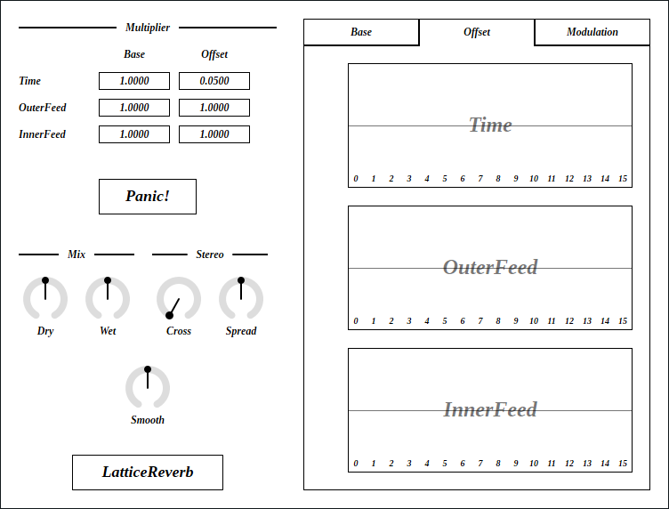
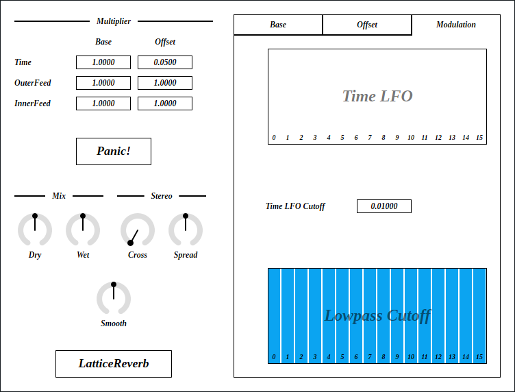

---
lang: ja
...

# LatticeReverb


<ruby>LatticeReverb<rt>ラティス リバーブ</rt></ruby> はディレイを使った高次のオールパスフィルタを格子状につないで入れ子にしたリバーブです。 1 チャンネルあたり 16 のオールパスフィルタを備えています。


- [LatticeReverb {{ latest_version["LatticeReverb"] }} `{{ target }}` - VST 3 をダウンロード (github.com)]({{ download_url }}) 


- [プリセットをダウンロード (github.com)]({{ preset_download_url["LatticeReverb"] }})


{{ section["package"] }}

{{ section["contact_installation_guiconfig"] }}

## 操作
{{ section["gui_common"] }}

{{ section["gui_knob"] }}

{{ section["gui_barbox"] }}

## 注意
サンプリング周波数やバッファサイズによって出力が変わります。

次の手順に沿った操作が行われると出力が大きくなることがあります。

1. `OuterFeed` あるいは `InnerFeed` のいくつかを最大値あるいは最小値の近くに設定。
2. 信号を入力。
3. 手順 1. で設定した `OuterFeed` あるいは `InnerFeed` の値を変更する。

## ブロック線図
図が小さいときはブラウザのショートカット <kbd>Ctrl</kbd> + <kbd>マウスホイール</kbd> や、右クリックから「画像だけを表示」などで拡大できます。

図で示されているのは大まかな信号の流れです。実装と厳密に対応しているわけではないので注意してください。


## パラメータ
`Base` は左右のチャンネルで両方で使われる値です。 `Base` によってリバーブの大まかな質感が決まります。

`Offset` は左右のチャンネルの値の比率です。 `Offset` によって左右の広がりを作ることができます。

```
if (Offset >= 0) {
  valueL = Base
  valueR = Base * (1 - Offset)
}
else {
  valueL = Base * (1 + Offset)
  valueR = Base
}
```

Time

:   オールパスフィルタのディレイ時間です。

OuterFeed

:   格子構造のフィードバック、フィードフォワードの値です。

InnerFeed

:   格子構造の内側に入れ子になったオールパスフィルタのフィードバック、フィードフォワードの値です。

### Multiplier
`Time` 、 `OuterFeed` 、 `InnerFeed` の値をまとめて変更する係数です。リバーブの質感を変えずに減衰時間を変えるときに使えます。

### Panic!
ボタンを押すと `Time` 、 `OuterFeed` 、 `InnerFeed` の Multiplier を 0 にしてリバーブの出力を止めます。

出力が想定外に大きくなったときなど、音を手早く止めたいときに使えます。

### Mix
Dry

:   バイパスされる入力信号の音量です。

Wet

:   リバーブを通った信号の音量です。

### Stereo
Cross

:   格子の偶数段で左右のチャンネルの信号をミックスする割合です。

    0 のときはもう片方のチャンネルからの信号はミックスされません。 0.5 のときは現在のチャンネルともう片方のチャンネルの信号比が 1:1 になります。

Spread

:   ミッドとサイド (M-S) の信号の比率です。

    ミッドとサイドの信号は次の式で計算されます。

    ```
    mid  = left + right
    side = left - right

    left  = mid - Spread * (mid - side)
    right = mid - Spread * (mid + side)
    ```

### Misc.
Smooth

:   パラメータを変更したときに、変更前の値から変更後の値へと移行する大まかな秒数です。

### Base


`Time` 、 `OuterFeed` 、 `InnerFeed` の左右のチャンネルで共通する値を設定するタブです。

リバーブの大まかなキャラクタは Base タブの設定で決まります。

### Offset


`Time` 、 `OuterFeed` 、 `InnerFeed` の左右のチャンネル間での差を設定するタブです。

Offset タブの値を変えると左右の広がりが出ます。

### Modulation


Time LFO

:   LFO によって `Time` を変調する量です。

    LFO の波形はノイズ（一様乱数）です。 `Time LFO Cutoff` と `Smooth` の値によって滑らかさが変わります。

Time LFO Cutoff

:   LFO にかけるローパスフィルタのカットオフ周波数です。

Lowpass Cutoff

:   格子の各段に備えられたローパスフィルタのカットオフ周波数です。

    リバーブの明るさを変更するときに役立ちます。

## チェンジログ

- {{version}}
  
  - {{ log }}
  


## 旧バージョン

旧バージョンはありません。

  
- [LatticeReverb {{ x["version"] }} - VST 3 (github.com)]({{ x["url"] }})
  


## ライセンス
LatticeReverb のライセンスは GPLv3 です。 GPLv3 の詳細と、利用したライブラリのライセンスは次のリンクにまとめています。

- [https://github.com/ryukau/VSTPlugins/tree/master/License](https://github.com/ryukau/VSTPlugins/tree/master/License)

リンクが切れているときは `ryukau@gmail.com` にメールを送ってください。

### VST® について
VST is a trademark of Steinberg Media Technologies GmbH, registered in Europe and other countries.
