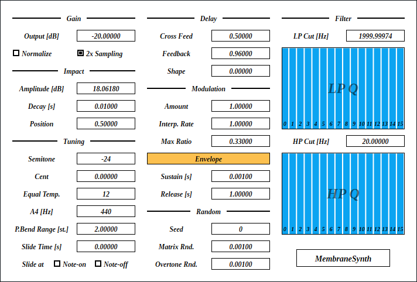
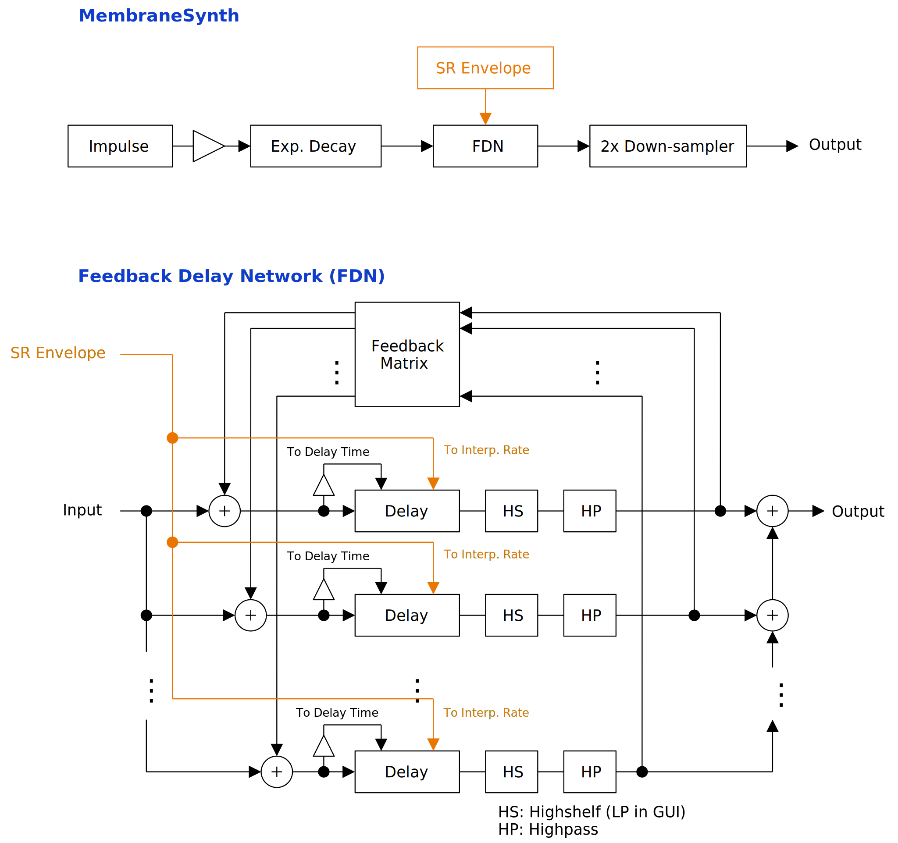

---
lang: en
...

# MembraneSynth

MembraneSynth is a synthesizer that resembles sound of percussions with membrane, like bass drum or tom tom. Some strange noise can also be made by utilizing oscillation caused by self-modulation.


- [Download MembraneSynth {{ latest_version["MembraneSynth"] }} `{{ target }}` - VST 3 (github.com)]({{ download_url }}) 


- [Download Presets (github.com)]({{ preset_download_url["MembraneSynth"] }})


{{ section["package"] }}

{{ section["contact_installation_guiconfig"] }}

## Controls
{{ section["gui_common"] }}

{{ section["gui_knob"] }}

{{ section["gui_barbox"] }}

## Caution
Recommend to insert limiter after MembraneSynth because output amplitude varies greatly.

It may oscillates when following conditions are met:

- `Modulation -> Amount` is greater than 0.
- `Interp. Rate` is greater than 0.
- `Envelope` is disabled.

Oscillation can be utilized for some noisy drone or sound effects, however it can be a problem when making percussion sounds. Recommend to always enable `Envelope` for percussion sounds.

## Block Diagram
If the image is small, use <kbd>Ctrl</kbd> + <kbd>Mouse Wheel</kbd> or "View Image" on right click menu to scale.

Diagram only shows overview. It's not exact implementation.

## Parameters
Characters inside of square brackets \[\] represents unit. Following is a list of units used in MembraneSynth.

- \[dB\] : Decibel.
- \[s\] : Second.
- \[st.\] : Semitone.
- \[Hz\] : Hertz.

FDN is short for feedback delay network. See block diagram for details about FDN.

### Gain
Output \[dB\]

:   Output gain.

Normalize

:   When checked, output gain is normalized to keep almost same gain regardless of `Impact -> Amplitude`.

2x Sampling

:   When checked, it enables 2-fold oversampling.

### Impact
Impact section provides parameters for excitation. Excitation here means the signal that imitates the impact of stick and membrane.

Amplitude \[dB\]

:   Maximum amplitude of excitation. Roughly represents the intensity of impact.

Decay \[s\]

:   Decay time of excitation. Roughly represents the time that the membrane returns to resting position after impact.

    Increasing the value of `Decay` adds more low frequency. Depending on other parameter settings, rattling may vanish when `Decay` is greater than some certain value.

Position

:   `Position` introduces bias the FDN input gain to resemble the position of impact.

    Intention was to represent the center of membrane for `Position = 0`, and the rim of  membrane for `Position = 1`. However, it doesn't make much difference to the output sound.

### Tuning
Tuning section provides pitch related parameters.

Note that most of the time, the output of MembraneSynth might be out of tuning. If it is required to tune the pitch exactly to provided note, recommend to render the output sound, and use external sampler.

Semitone, Cent

:   Pitch in semitone or cent. 1 semitone equals to 100 cents.

Equal Temp., A4 \[Hz\]

:   `Equal Temp.` is abbreviation of equal temperament (ET). When `Equal Temp.` is 12, then the tuning becomes standard 12 ET. Setting `Equal Temp.` to less than 12 might increase the range of note that doesn't change output sound, due to the internal pitch becomes too high or too low.

    `A4 [Hz]` is freqeuncy of note A4.

P.Bend Range \[st.\]

:   Range of pitch bend in semitone.

Slide Time \[s\]

:   Time to slide the pitch of latest note.

    Note that the time indicated in user interface is not exact. Internally, the value is converted to cutoff frequency of smoothing filter.

Slide at Note-on, Note-off

:   When checked, apply pitch slide at note-on or note-off.

    For percussion sounds, it may sound more natural without pitch slide.

### Delay
Delay section provides parameters for feedback and delay time tuning.

Cross Feed

:   Amount of cross feedback between delays.

    Higher value of `Cross Feed` adds more cross feedback, and harmonics become more complex.

Feedback

:   Amount of feedback of FDN.

    `Feedback` is used to change the length of sound. Oscillation can also be suppressed by decreasing `Feedback`.

Shape

:   Switch the delay time multiplier between string modes and circular membrane modes.

    When `Shape` is 0, the multipliers use string modes and it becomes 1, 2, 3, and so on. When `Shape` is 1, the multipliers use circular membrane modes and it becomes 1, 1.59, 2.13, and so on.

### Modulation
Modulation section provides parameters related to self-modulation of FDN.

Amount

:   Amount of modulation to delay time by the absolute amplitude of feedback signal.

    When `Amount` is not 0, the pitch might drop like tom tom.

Interp. Rate

:   Slew rate of delay time modulation per sample.

    Higher `Interp. Rate` means more modulation, but also increases the risk of oscillation.

Max Ratio

:   Maximum of modulation represented as a ratio to resting delay time.

    For example, when `Max Ratio` is 0.3, and resting delay time is 1.0, the maximally modulated delay time becomes 0.7.

Envelope

:   When lit, it enables modulation envelope.

    Modulation envelope decreases `Interp. Rate` through time to suppress oscillation. Recommend to always turn on for percussion sounds.

Sustain \[s\]

:   Sustain time of modulation envelope. Lengthen the sustain time tends to be more unnatural sound.

Release \[s\]

:   Release time of modulation envelope. When oscillating, shorten the release time might result in more natural sound.

### Random
Random section provides parameters for randomization for each note-on.

Seed

:   Seed value of random number sequence.

    Changing `Seed` also changes the feedback matrix of FDN, and it changes the texture of cross feedback.

Matrix Rnd.

:   Ratio of randomization to the feedback matrix of FDN.

Overtone Rnd.

:   Maximum of random number that added to delay time multiplier.

### Filter
Filter section provides parameters to tune the filters inserted in the feedback path of FDN.

LP Cut \[Hz\], HP Cut \[Hz\]

:   Cutoff frequency of lowpass (LP) or highpass (HP) filters.

    Lowpass is actually highshelf with the gain fixed to 0.5 (~= -6.02 dB). It is labeled as lowpass on the interface because it felt more intuitive.

LP Q, HP Q

:   Q factor of lowpass (LP) or highpass (HP).

    Q factors don't change the output sound that much. They can be ignored unless fine tuning is required. That said, following 2 recipes might be useful to suppress oscillation in some cases. Both reduces low frequency of the output sound.

    - Decrease index 0 (leftmost) of `HP Q`.
    - Decrease index 12 to 15 (3 bars from rightmost) of `HP Q`.

## Change Log

- {{version}}
  
  - {{ log }}
  


## Old Versions

N/A.

  
- [MembraneSynth {{ x["version"] }} - VST 3 (github.com)]({{ x["url"] }})
  


## License
MembraneSynth is licensed under GPLv3. Complete licenses are linked below.

- [https://github.com/ryukau/VSTPlugins/tree/master/License](https://github.com/ryukau/VSTPlugins/tree/master/License)

If the link above doesn't work, please send email to `ryukau@gmail.com`.

### About VST
VST is a trademark of Steinberg Media Technologies GmbH, registered in Europe and other countries.
