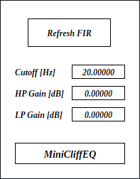

---
lang: ja
...

# MiniCliffEQ


<ruby>MiniCliffEQ<rt>ミニ クリフ イーキュー</rt></ruby> はタップ数 2^15 = 32768 の FIR フィルタです。あまりにもタップ数が多いのでレイテンシがサンプリング周波数 48000 Hz のときに 1 秒を超えます。主な用途は直流信号 (DC) の抑制ですが、とても急峻なローパス、ハイパス、ローシェルフ、ハイシェルフフィルタとしても使えます。

- [MiniCliffEQ 0.1.0 をダウンロード - VST® 3 (github.com)](https://github.com/ryukau/VSTPlugins/releases/download/UhhyouPlugins0.34.0/MiniCliffEQ_0.1.0.zip) 
- [プリセットをダウンロード (github.com)](https://github.com/ryukau/VSTPlugins/releases/download/UhhyouPlugins0.34.0/MiniCliffEQPresets.zip)

パッケージには次のビルドが含まれています。

- Windows 64bit
- Linux 64bit
- macOS universal binary

Linux ビルドは Ubuntu 20.04 でビルドしています。もし Ubuntu 20.04 以外のディストリビューションを使っているときは、プラグインが読み込まれないなどの不具合が起こることがあります。この場合は[ビルド手順](https://github.com/ryukau/VSTPlugins/blob/master/build_instruction.md)に沿ってソースコードからビルドしてください。

## 連絡先
何かあれば [GitHub のリポジトリ](https://github.com/ryukau/VSTPlugins)に issue を作るか `ryukau@gmail.com` までお気軽にどうぞ。

[paypal.me/ryukau](https://www.paypal.com/paypalme/ryukau) から開発資金を投げ銭することもできます。現在の目標はよりよい macOS サポートのための M1 mac の購入資金を作ることです。 💸💻

## インストール
### プラグイン
名前が `.vst3` で終わるディレクトリを OS ごとに決められた位置に配置してください。

- Windows では `/Program Files/Common Files/VST3/` に配置します。
- Linux では `$HOME/.vst3/` に配置します。
- macOS では `/Users/$USERNAME/Library/Audio/Plug-ins/VST3/` に配置します。

DAW によっては上記とは別に VST3 をインストールできるディレクトリを提供していることがあります。詳しくは利用している DAW のマニュアルを参照してください。

### プリセット
解凍して出てきたディレクトリを OS ごとに決められた位置に配置すると使えるようになります。

- Windows : `/Users/$USERNAME/Documents/VST3 Presets/Uhhyou`
- Linux : `$HOME/.vst3/presets/Uhhyou`
- macOS : `/Users/$USERNAME/Library/Audio/Presets/Uhhyou`

プリセットディレクトリの名前はプラグインと同じである必要があります。 `Uhhyou` ディレクトリが無いときは作成してください。

### Windows
プラグインが DAW に認識されないときは C++ redistributable をインストールしてみてください。インストーラは次のリンクからダウンロードできます。ファイル名は `vc_redist.x64.exe` です。

- [The latest supported Visual C++ downloads](https://support.microsoft.com/en-us/help/2977003/the-latest-supported-visual-c-downloads)

### Linux
Ubuntu 18.0.4 では次のパッケージのインストールが必要です。

```bash
sudo apt install libxcb-cursor0  libxkbcommon-x11-0
```

もし DAW がプラグインを認識しないときは、下のリンクの `Package Requirements` を参考にして VST3 に必要なパッケージがすべてインストールされているか確認してください。

- [VSTGUI: Setup](https://steinbergmedia.github.io/vst3_doc/vstgui/html/page_setup.html)

REAPER の Linux 版がプラグインを認識しないときは `~/.config/REAPER/reaper-vstplugins64.ini` を削除して REAPER を再起動してみてください。

### macOS
**注意**: この節は英語で macOS を使用しているユーザからの報告によって作成されました。日本語でのエラーメッセージが分からなかったので曖昧な書き方になっています。

プラグインの初回起動時に「破損している」という趣旨のメッセージが表示されることがあります。この場合は、ターミナルを開いて、解凍した `.vst3` ディレクトリに次のコマンドを適用してみてください。

```sh
xattr -rc /path/to/PluginName.vst3
```

プラグインは署名されていない (unsigned) 、または公証されていない (un-notarized) アプリケーションとして認識されることがあります。この場合は以下の手順を試してみてください。

1. ターミナルを開いて `sudo spctl --master-disable` を実行。
2. システム環境設定 → セキュリティとプライバシー → 一般 → ダウンロードしたアプリケーションの実行許可、を開いて 「全てのアプリケーションを許可」 を選択。

上記の手順を実行するとシステムのセキュリティが弱くなるので注意してください。元に戻すには以下の手順を実行してください。

1. システム環境設定 → セキュリティとプライバシー → 一般 → ダウンロードしたアプリケーションの実行許可、を開いて 「App Store と認証済みの開発元からのアプリケーションを許可」 を選択。
2. ターミナルを開いて `sudo spctl --master-enable` を実行。

#### 参考リンク
- [How to Fix App “is damaged and can’t be opened. You should move it to the Trash” Error on Mac](https://osxdaily.com/2019/02/13/fix-app-damaged-cant-be-opened-trash-error-mac/)
- [Allowing unsigned/un-notarized applications/plugins in Mac OS | Venn Audio](https://www.vennaudio.com/allowing-unsigned-un-notarized-applications-plugins-in-mac-os/)
- [Safely open apps on your Mac - Apple Support](https://support.apple.com/en-us/HT202491)

## GUI の見た目の設定
初回設定時は手動で次のファイルを作成してください。

- Windows では `/Users/ユーザ名/AppData/Roaming/UhhyouPlugins/style/style.json` 。
- Linux では `$XDG_CONFIG_HOME/UhhyouPlugins/style/style.json` 。
  - `$XDG_CONFIG_HOME` が空のときは `$HOME/.config/UhhyouPlugins/style/style.json` 。
- macOS では `/Users/$USERNAME/Library/Preferences/UhhyouPlugins/style/style.json` 。

既存の色のテーマを次のリンクに掲載しています。 `style.json` にコピペして使ってください。

- [LV2Plugins/style/themes at master · ryukau/LV2Plugins · GitHub](https://github.com/ryukau/LV2Plugins/tree/master/style/themes)

`style.json` の設定例です。

```json
{
  "fontFamily": "Tinos",
  "fontBold": true,
  "fontItalic": true,
  "foreground": "#000000",
  "foregroundButtonOn": "#000000",
  "foregroundInactive": "#8a8a8a",
  "background": "#ffffff",
  "boxBackground": "#ffffff",
  "border": "#000000",
  "borderCheckbox": "#000000",
  "borderLabel": "#000000",
  "unfocused": "#dddddd",
  "highlightMain": "#0ba4f1",
  "highlightAccent": "#13c136",
  "highlightButton": "#fcc04f",
  "highlightWarning": "#fc8080",
  "overlay": "#00000088",
  "overlayHighlight": "#00ff0033"
}
```

### フォントオプション
以下はフォントオプションの一覧です。

- `fontFamily`: フォントファミリ名。
- `fontBold`: ボールドスタイル (太字) を `true` で有効、 `false` で無効。
- `fontItalic`: イタリックスタイル (斜体) を `true` で有効、 `false` で無効。

カスタムフォントを使用するには、プラグインディレクトリの `*.vst3/Contents/Resources/Fonts` に `*.ttf` ファイルを配置します。

**注意**: `fontFamily` 、 `fontBold` 、 `fontItalic` で設定したフォントファミリ名とスタイルの組み合わせが `*.vst3/Contents/Resources/Fonts` 以下のいずれかの `*.ttf` ファイルに含まれていないときは VSTGUI が指定するデフォルトフォントが使用されます。

`fontFamily` が長さ 0 の文字列 `""` のときはフォールバックとして [`"Tinos"`](https://fonts.google.com/specimen/Tinos) に設定されます。長さが 1 以上かつ、存在しないフォントファミリ名が指定されると VSTGUI が指定するデフォルトフォントが使用されます。

ボールドあるいはイタリック以外のスタイルは VSTGUI がサポートしていないので動作確認していません。該当する例としては Noto フォントの Demi Light や、 Roboto フォントの Thin や Black などがあります。

### 色のオプション
16 進数カラーコードを使っています。

- 6 桁の色は RGB 。
- 8 桁の色は RGBA 。

プラグインはカラーコードの 1 文字目を無視します。よって `?102938` や `\n11335577` も有効なカラーコードです。

2 文字目以降のカラーコードの値に `0-9a-f` 以外の文字を使わないでください。

以下は設定できる色の一覧です。設定に抜けがあるとデフォルトの色が使われます。

- `foreground`: 文字の色。
- `foregroundButtonOn`: オンになっているボタンの文字の色。 `foreground` か `boxBackground` のいずれかと同じ値にすることを推奨します。
- `foregroundInactive`: 非アクティブなタブの文字の色。
- `background`: 背景色。
- `boxBackground`: 矩形の UI 部品の内側の背景色。
- `border`: <ruby>縁<rt>ふち</rt></ruby>の色。
- `borderCheckbox`: チェックボックスの縁の色。
- `borderLabel`: パラメータセクションのラベルの左右の直線の色。
- `unfocused`: つまみがフォーカスされていないときの色。
- `highlightMain`: フォーカスされたときの色。スライダの値の表示にも使用されます。
- `highlightAccent`: フォーカスされたときの色。一部のプラグインをカラフルにするために使用されます。
- `highlightButton`: ボタンがフォーカスされたときの色。
- `highlightWarning`: 変更に注意を要する UI がフォーカスされたときの色。
- `overlay`: オーバーレイの色。
- `overlayHighlight`: フォーカスを示すオーバーレイの色。

## 操作
つまみと数値スライダでは次の操作ができます。

- <kbd>Ctrl</kbd> + <kbd>左クリック</kbd> : 値のリセット。
- <kbd>Shift</kbd> + <kbd>左ドラッグ</kbd> : 細かい値の変更。

## 注意
49150 サンプルのレイテンシが加わります。

## 使い方
MiniCliffEQ の用途としては直流 (DC) の除去と、細かいノイズの検出を考慮しています。線形位相フィルタなのでバンドスプリッタとして使うこともできます。もちろん音を作る用途にも使えますが、レイテンシが大きいので通常のイコライザで足りる場面では使わないことを推奨します。

直流を除去するときは起動直後に `LP Gain` を 2 回 <kbd>ホイールクリック</kbd> して `-inf` に設定してください。 `Cutoff` は普通のスピーカであれば初期値の 20 Hz のままで問題ありません。 10 Hz を下回るとカットオフ周波数の正確さとロールオフの急峻さが損なわれる点に注意してください。 `Cutoff` が 1 Hz のときの振幅特性は 1 Hz で -16.25 dB 、 0.1 Hz で -60 dB です。

細かいノイズの検出を行うときは以下の手順を踏みます。

1. MiniCliffEQ の後にリミッタを挿入する。
2. `LP Gain` を `-inf` に設定する。
3. 入力信号が消えるまで `Cutoff` を上げる。 `Refresh FIR` を忘れずに！
4. `HP Gain` を `144.5` に設定する。

例えば上記の設定に 100 Hz のサイン波を入力して何らかの音が出るときはノイズが乗っていると言えます。ただしゲインを 144.5 dB 上げてようやく聞こえるノイズというのは人間の耳には知覚されることはまずありません。このようなノイズ検出は音の品質を探るというよりも、アルゴリズムを推定するときに使えます。

MiniCliffEQ のフィルタ係数を計算するアルゴリズムは以下の Python 3 のコードと同じです。

```python
import scipy.signal as signal
samplerate = 48000
cutoffHz = 20
fir = signal.firwin(2**15 - 1, cutoffHz, window="nuttall", fs=samplerate)
```

## パラメータ
Refresh FIR

:   `Cutoff` の変更後に `Refresh FIR` ボタンを押すことで FIR フィルタ係数を更新します。 `Refresh FIR` ボタンを押すと内部状態がリセットされて、レイテンシの長さだけ音が止まるので注意してください。

Cutoff \[Hz\]

:   フィルタのカットオフ周波数です。

HP Gain \[dB\]

:   ハイパス出力のゲインです。

LP Gain \[dB\]

:   ローパス出力のゲインです。

## チェンジログ
- 0.1.1
  - FIR フィルタの正規化の精度向上のために `std::accumulate` を使うように変更。
- 0.1.0
  - 初期リリース。

## 旧バージョン
### MiniCliffEQ
旧バージョンはありません。

## ライセンス
MiniCliffEQ のライセンスは GPLv3 です。 GPLv3 の詳細と、利用したライブラリのライセンスは次のリンクにまとめています。

- [https://github.com/ryukau/VSTPlugins/tree/master/License](https://github.com/ryukau/VSTPlugins/tree/master/License)

リンクが切れているときは `ryukau@gmail.com` にメールを送ってください。

### VST® について
VST is a trademark of Steinberg Media Technologies GmbH, registered in Europe and other countries.
