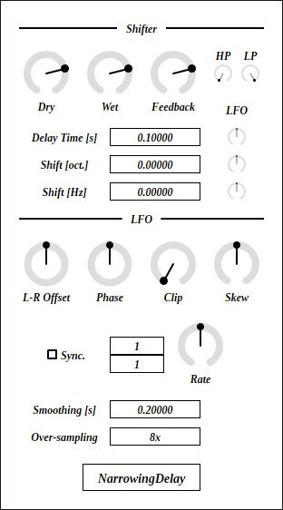

---
lang: ja
...

# NarrowingDelay


<ruby>NarrowingDelay<rt>ナロウイング ディレイ</rt></ruby> は直列につないだピッチシフタと周波数シフタがフィードバック経路に設けられたディレイです。フィードバックのたびに音のスペクトラムを周波数軸の方向に広げる、あるいは狭めることができます。どちらかと言えばピッチが一定しない音との相性がいいです。ノートイベントで周波数シフタのシフト量を制御することもできます。


- [NarrowingDelay {{ latest_version["NarrowingDelay"] }} `{{ target }}` - VST 3 をダウンロード (github.com)]({{ download_url }}) 


- [プリセットをダウンロード (github.com)]({{ preset_download_url["NarrowingDelay"] }})


{{ section["package"] }}

{{ section["contact_installation_guiconfig"] }}

## 操作
{{ section["gui_common"] }}

{{ section["gui_knob"] }}

## ブロック線図
図が小さいときはブラウザのショートカット <kbd>Ctrl</kbd> + <kbd>マウスホイール</kbd> や、右クリックから「画像だけを表示」などで拡大できます。

図で示されているのは大まかな信号の流れです。実装と厳密に対応しているわけではないので注意してください。


## ノートイベントの入力
NarrowingDelay はノートイベントによって周波数シフトの量を制御することができます。以下は周波数シフトの量の計算式です。

```
# `note` は MIDI ノート番号。
(周波数シフトの量) = 2^((note - 69) / 12) * ((Shift [Hz] の値) + lfo).
```

## パラメータ
角かっこ \[\] で囲まれているのは単位です。以下は NarrowingDelay のパラメータで使われている単位の一覧です。

- \[s\]: 秒 (second) 。
- \[oct.\]: オクターブ (octave) 。
- \[Hz\]: 周波数 (Herz) 。

### Shifter
Dry

:   入力信号のゲインです。

Wet

:   NarrowingDelay を通過した信号のゲインです。

Feedback

:   フィードバックの量です。

HP, LP

:   フィードバック経路のハイパス (`HP`) あるいはローパス (`LP`) フィルタのカットオフ周波数です。

Delay Time \[s\]

:   ピッチシフタのバッファの長さです。値は厳密なディレイ時間ではなく、大まかな目安です。

    `Shift \[oct.\]` の値が 0.0 でないときはバッファを読み取る速度が変わるので、実際のディレイ時間は表示されている値と一致しなくなります。

Shift \[oct.\], Shift \[Hz\]

:   `Shift [oct.]` はピッチシフトの量、 `Shift [Hz]` は周波数シフトの量です。

    入力信号の周波数に対して、ピッチシフトは乗算、周波数シフトは加算を行います。式にすると以下のように書けます。

    ```
    (出力周波数) ~= (入力周波数) * 2^(ピッチシフトの量) + (周波数シフトの量).
    ```

    つまり、ピッチシフトの量が 0.0 より小さいときはスペクトラムが狭まり、 0.0 より大きいときはスペクトラムが広がります。 NarrowingDelay はスペクトラムを狭めた後に周波数シフトによって入力と出力の基本周波数を一致させれば面白い音になるのではないかという思いつきで作られました。

    NarrowingDelay の周波数シフトのアルゴリズムでは周波数を下げるようにシフトすることができません。そのためスペクトラムを広げた後に周波数を下げて基本周波数を一致させることはできません。

LFO

:   LFO による変調量です。以下の 3 つのパラメータに変調をかけることができます。

    - `Delay Time [s]`
    - `Shift [oct.]`
    - `Shift [Hz]`

### LFO
L-R Offset

:   ステレオチャンネル間で LFO の位相をずらす量です。

Phase

:   LFO の位相に加算される値です。

    `Rate` を左いっぱいに回して LFO の位相を止めているときに `Phase` の値を変更することで、 LFO の位相を制御することができます。また `Smoothing` の値によって `Phase` を動かしたときの応答速度を変えることができます。

Clip, Skew

:   LFO の波形を変更するパラメータです。以下は計算式です。

    ```
    # `phase` の範囲は [0, 1) 。
    wave = sin(2 * π * phase^Skew).
    lfo = clamp(Clip * wave, -1, 1).
    ```

Sync.

:   チェックを入れるとテンポ同期を有効にします。また同期間隔が変わったときに再生開始時点から導かれる位相へと同期します。

    チェックが外れているときは 120 BPM に同期した状態と同じになります。ただし、同期間隔が変わったときに位相を調整しなくなります。

Tempo Upper

:   テンポ同期が有効な時の同期間隔を表す分数の分子です。

    `1/1` のときに 1 小節、 4/4拍子であれば `1/4` のときに 1 拍で LFO が 1 周します。 `Rate` が乗算されて周期が変わる点に注意してください。

    以下は同期間隔の計算式です。

    ```
    syncInterval = (Rate) * (Tempo Upper) / (Tempo Lower);
    ```

Tempo Lower

:   テンポ同期が有効な時の同期間隔を表す分数の分母です。

    `Rate` が乗算されて周期が変わる点に注意してください。

Rate

:   同期間隔に乗算される係数です。

    `Tempo Upper` と `Tempo Lower` を変えずに LFO の同期間隔を変えたいときに使えます。

Smoothing \[s\]

:   パラメータのスムーシング時間です。

    例えば `Smoothing` の値を `0.01` と短くするとパラメータの変更がほぼ瞬時に適用されます。ただし `Smoothing` の値を小さくするとパラメータ変更時のポップノイズが目立つようになります。逆に `Smoothing` の値を `1.0` などと長くするとパラメータの値がゆっくりと切り替わるようになります。

Oversampling

:   オーバーサンプリングの倍率です。

    - `1x`: オーバーサンプリングを行いません。 CPU 負荷は下がりますが、エイリアシングノイズが目立ちます。ただし NarrowingDelay の出力はそもそも音程が合わないので、エイリアシングノイズも味わいとして使える場面があります。
    - `2x`: 2 倍のオーバーサンプリングを行います。
    - `8x`: 8 倍のオーバーサンプリングを行います。 CPU 負荷は上がりますが、エイリアシングノイズが減るので、スペクトラムを広げる設定との相性がいいです。

## チェンジログ

- {{version}}
  
  - {{ log }}
  


## 旧バージョン
### NarrowingDelay

旧バージョンはありません。

  
- [NarrowingDelay {{ x["version"] }} - VST 3 (github.com)]({{ x["url"] }})
  


## ライセンス
NarrowingDelay のライセンスは GPLv3 です。 GPLv3 の詳細と、利用したライブラリのライセンスは次のリンクにまとめています。

- [https://github.com/ryukau/VSTPlugins/tree/master/License](https://github.com/ryukau/VSTPlugins/tree/master/License)

リンクが切れているときは `ryukau@gmail.com` にメールを送ってください。

### VST® について
VST is a trademark of Steinberg Media Technologies GmbH, registered in Europe and other countries.
