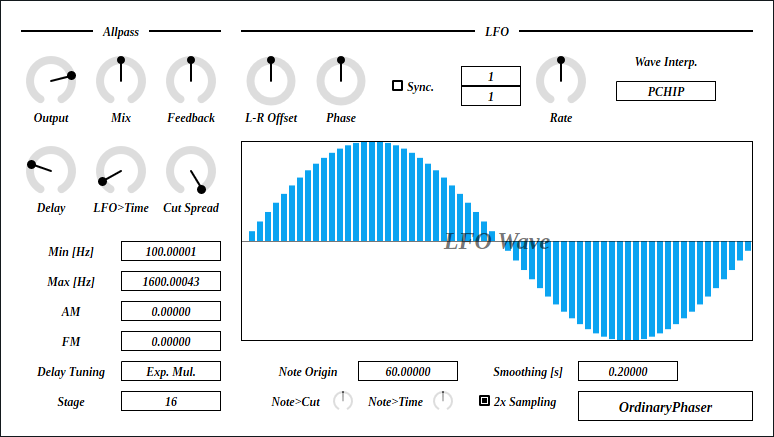
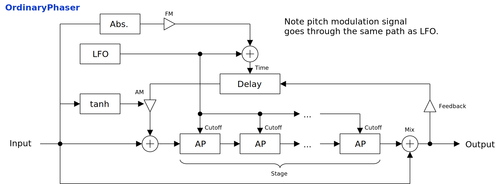

---
lang: ja
...

# OrdinaryPhaser


<ruby>OrdinaryPhaser<rt>オーディナリ フェイザ</rt></ruby> はフィードバック経路にディレイが搭載されている点を除けば、普通のフェイザです。ノートイベントによってオールパスフィルタのカットオフ周波数とディレイ時間を制御できます。


- [OrdinaryPhaser {{ latest_version["OrdinaryPhaser"] }} `{{ target }}` - VST 3 をダウンロード (github.com)]({{ download_url }}) 


- [プリセットをダウンロード (github.com)]({{ preset_download_url["OrdinaryPhaser"] }})


{{ section["package"] }}

{{ section["contact_installation_guiconfig"] }}

## 操作
{{ section["gui_common"] }}

{{ section["gui_knob"] }}

{{ section["gui_barbox"] }}

## ブロック線図
図が小さいときはブラウザのショートカット <kbd>Ctrl</kbd> + <kbd>マウスホイール</kbd> や、右クリックから「画像だけを表示」などで拡大できます。

図で示されているのは大まかな信号の流れです。実装と厳密に対応しているわけではないので注意してください。



## ノートイベントの入力
OrdinaryPhaser はノートイベントによって以下の値を制御することができます。

- オールパスフィルタのカットオフ周波数
- フィードバックのディレイ時間

起動直後は `Note>Cut` と `Note>Time` の値が両方とも 0 になっていることに注意してください。少なくとも片方の値を 0 以外に設定しなければ変調はかかりません。

## パラメータ
角かっこ \[\] で囲まれているのは単位です。以下は OrdinaryPhaser のパラメータで使われている単位の一覧です。

- \[s\]: 秒 (second) 。
- \[Hz\]: 周波数 (Herz) 。

### Allpass
Output

:   出力ゲインです。

Mix

:   入力信号とフェイザを通過した信号を混ぜる比率です。

    左いっぱいにすると入力信号をバイパスするだけになります。右いっぱいに近づくほどフィードバックが強くかかるようになります。

Feedback

:   フィードバックのゲインです。

Delay

:   フィードバック信号のディレイ時間です。

LFO>Time

:   LFO によるディレイ時間の変調量です。

    `Delay Tuning` によって変調のかかり方を変更できます。

Cut Spread

:   オールパスフィルタのカットオフ周波数の倍率を `[1, 1, 1, ...]` と `[1, 2, 3, ...]` の間で調整します。

    フェイザは複数のオールパスフィルタを直列に繋いだエフェクタです。 `Cut Spread` が左いっぱいのときは、このオールパスフィルタのカットオフ周波数をすべて同じにします。 `Cut Spread` が右いっぱいのときは、オールパスフィルタのカットオフ周波数が前から順に 1 倍、 2 倍、 3 倍、と設定されます。

Min \[Hz\]

:   オールパスフィルタのカットオフ周波数が LFO によって変調されたときの最小値です。

Max \[Hz\]

:   オールパスフィルタのカットオフ周波数が LFO によって変調されたときの最大値です。

    `Max` が `Min` より小さいときは、値を入れ替えて計算が続けられます。つまり、この 2 つのパラメータの値を入れ替えても挙動は変わりません。

AM

:   入力信号によってフィードバック信号に振幅変調をかける量です。

    発散を防ぐため、 AM に使われる信号は `tanh` によって値の範囲が制限されます。つまり、入力信号の振幅に応じて変調のかかり方が非線形に変化します。

FM

:   入力信号によってフィードバック経路のディレイ時間を変調する量です。

    負のディレイ時間を設定することを避けるため、 FM に使われる信号は `abs` で全波整流されます。

Delay Tuning

:   LFO によるディレイ時間への変調のかけ方です。

    - `Exp Mul.`: 変調信号を `exp2` を通した上でディレイ時間に乗算します。人間の耳には自然な変調のかかり方です。
    - `Linear Mul.`: 変調信号をそのままディレイ時間に乗算します。
    - `Add`: 変調信号をディレイ時間に加算します。 LFO と組み合わせてグリッチビートを作るときには適しています。
    - `Fill Lower`: `Delay` の値を下回る範囲で `Add` と同様の変調をかけます。
    - `Fill Higher`: `Delay` の値を上回る範囲で `Add` と同様の変調をかけます。

Stage

:   直列に接続するオールパスフィルタの数です。

### LFO
L-R Offset

:   ステレオチャンネル間で LFO の位相をずらす量です。

Phase

:   LFO の位相に加算される値です。

    `Rate` を左いっぱいに回して LFO の位相を止めているときに `Phase` の値を変更することで、 LFO の位相を制御することができます。また `Smoothing` の値によって `Phase` を動かしたときの応答速度を変えることができます。

Sync.

:   チェックを入れるとテンポ同期を有効にします。また同期間隔が変わったときに再生開始時点から導かれる位相へと同期します。

    チェックが外れているときは 120 BPM に同期した状態と同じになります。ただし、同期間隔が変わったときに位相を調整しなくなります。

Tempo Upper

:   テンポ同期が有効な時の同期間隔を表す分数の分子です。

    `1/1` のときに 1 小節、 4/4拍子であれば `1/4` のときに 1 拍で LFO が 1 周します。 `Rate` が乗算されて周期が変わる点に注意してください。

    以下は同期間隔の計算式です。

    ```
    syncInterval = (Rate) * (Tempo Upper) / (Tempo Lower);
    ```

Tempo Lower

:   テンポ同期が有効な時の同期間隔を表す分数の分母です。

    `Rate` が乗算されて周期が変わる点に注意してください。

Rate

:   同期間隔に乗算される係数です。

    `Tempo Upper` と `Tempo Lower` を変えずに LFO の同期間隔を変えたいときに使えます。

Wave Interp.

:   LFO の波形の補間方法です。

    - `Step`: ホールド。
    - `Linear`: 線形補間。
    - `PCHIP`: 単調な 3 次補間。

    `Step` を選ぶと LFO をシーケンサのように使えます。 `Linear` は `PCHIP` と似たような音になりますが、計算がすこし速いです。デフォルトの `PCHIP` はサンプル間をだいたい滑らかに補間します。

LFO Wave

:   LFO の波形です。

### Misc.
Note Origin

:   変調量が 1 倍となる MIDI ノート番号です。

    例えば `Note Origin` が 60 であれば、入力されたノート番号が 60 のときに音が変わらなくなります。

Note>Cut

:   ノートイベントによるオールパスフィルタのカットオフ周波数の変調量です。

    右いっぱいでノートのピッチに完全に追従します。左いっぱいにするとピッチの高低が逆転します。

Note>Time

:   ノートイベントによるディレイ時間の変調量です。

    右いっぱいでノートのピッチに完全に追従します。左いっぱいにするとピッチの高低が逆転します。

Smoothing \[s\]

:   パラメータのスムーシング時間です。

    例えば `Smoothing` の値を `0.01` と短くするとパラメータの変更がほぼ瞬時に適用されます。ただし `Smoothing` の値を小さくするとパラメータ変更時のポップノイズが目立つようになります。逆に `Smoothing` の値を `1.0` などと長くするとパラメータの値がゆっくりと切り替わるようになります。

2x Sampling

:   チェックを入れると 2 倍のオーバーサンプリングを行います。

## チェンジログ

- {{version}}
  
  - {{ log }}
  


## 旧バージョン
### OrdinaryPhaser

旧バージョンはありません。

  
- [OrdinaryPhaser {{ x["version"] }} - VST 3 (github.com)]({{ x["url"] }})
  


## ライセンス
OrdinaryPhaser のライセンスは GPLv3 です。 GPLv3 の詳細と、利用したライブラリのライセンスは次のリンクにまとめています。

- [https://github.com/ryukau/VSTPlugins/tree/master/License](https://github.com/ryukau/VSTPlugins/tree/master/License)

リンクが切れているときは `ryukau@gmail.com` にメールを送ってください。

### VST® について
VST is a trademark of Steinberg Media Technologies GmbH, registered in Europe and other countries.
