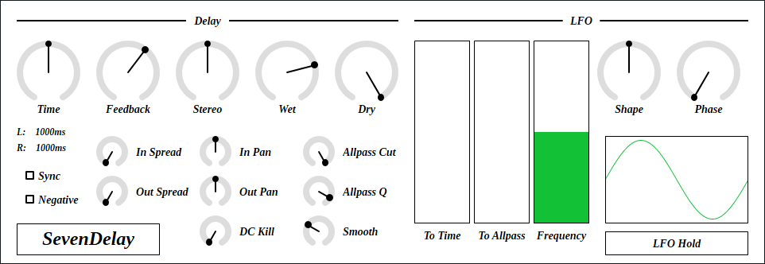

---
lang: en
...

# SevenDelay


SevenDelay is a stereo delay with 7th order lagrange interpolated fractional delay and 7x oversampling.


- [Download SevenDelay {{ latest_version["SevenDelay"] }} `{{ target }}` - VST 3 (github.com)]({{ download_url }}) 


- [Download Presets (github.com)]({{ preset_download_url["SevenDelay"] }})


{{ section["package"] }}

{{ section["contact_installation_guiconfig"] }}

## Controls
{{ section["gui_common"] }}

{{ section["gui_knob"] }}

## Caution
When the value of `Smooth` is near zero and change the value of `Allpass Cut` too fast, SevenDelay may output very loud click noise. This is caused by the filter which becomes unstable when cutoff frequency moves too fast. Recommendation is not to set `Smooth` parameter too low unless you have some specific purpose.

When the value of `Time` is set to minimum and the value of `Feedback` is set to maximum, SevenDelay outputs direct current (DC). To remove DC, Set `DC Kill` to be greater than 1.0.

## Block Diagram
If the image is small, use <kbd>Ctrl</kbd> + <kbd>Mouse Wheel</kbd> or "View Image" on right click menu to scale.

Diagram only shows overview. It's not exact implementation.


## Parameters
### Delay
Time

:   Delay time. Range is 0.0001 to 8.0.

    - If `Sync` is on and `Time` is less than 1.0, then delay time is set to `Time / 16` beats.
    - If `Sync` is on and `Time` is greater or equal to 1.0, then delay time is set to `floor(2 * Time) / 32` beats.
    - Otherwise, delay time is set to `Time` seconds.

Feedback

:   Delay feedback. Range is 0.0 to 1.0.

Stereo

:   L/R stereo offset. Range is -1.0 to 1.0.

    - If `Stereo` is less than 0.0, then left channel delay time is modified to `timeL * (1.0 + Stereo)`.
    - Otherwise, right channel delay time is modified to `timeR * (1.0 - Stereo)`.

Wet

:   Output volume of delayed signal. Range is 0.0 to 1.0.

Dry

:   Output volume of input signal. Range is 0.0 to 1.0.

Sync

:   Toggle tempo sync.

Negative

:   Toggle negative feedback. This may be useful when delay time is very short.

In/Out Spread/Pan

:   Panning controls. Range is 0.0 to 1.0.

    `In/Out Spread` controls stereo spread. `In/Out Pan` controls stereo panning.

    These parameter can be used for inverse panning, ping-pong delay etc.

    - For inverse panning, set `[InSpread, InPan, OutSpread, OutPan]` to `[0.0, 0.5, 1.0, 0.5]`.
    - For ping-pong delay, set `[InSpread, InPan, OutSpread, OutPan]` to `[1.0, 0.5, 0.0, 0.5]`.

    ```
    signalL = inL + spread * (inR - inL)
    signalR = inL + (1.0f - spread) * (inR - inL)

    if (pan < 0.5f) {
      outL = (0.5f + pan) * signalL + (0.5f - pan) * signalR,
      outR = signalR * 2.0f * pan,
    }
    else {
      outL = signalL * (2.0f - 2.0f * pan)
      outR = (pan - 0.5f) * signalL + (1.5f - pan) * signalR
    }
    ```

Allpass Cut

:   SFV allpass filter cutoff frequency. Range is 90.0 to 20000.0.

    If `Allpass Cut` is 20000.0, filter will be bypassed.

Allpass Q

:   SFV allpass filter resonance. Range is 0.00001 to 1.0.

DC Kill

:   Cutoff frequency of biquad highpass filter. Range is 1.0 to 120.0.

    `DC Kill` removes direct current from delay feedback when the value is set to be greater than 1.0.

Smooth

:   Parameter smoothing. Range is 0.0 to 1.0. Unit is seconds.

    Some parameter may produce noise when the value is changed too fast. Increasing `Smooth` reduces those noise.

### LFO
To Time

:   LFO modulation amount to delay time. Range is 0.0 to 1.0.

To Allpass

:   LFO modulation amount to allpass cutoff frequency. Range is 0.0 to 1.0.

Freq

:   LFO frequency. Range is 0.01 to 100.0.

Shape

:   LFO waveform shape. Range is 0.01 to 10.0.

    ```
    sign = 1 if (phase > π),
          -1 if (phase < π),
           0 if (phase == π)
    lfo = sign * abs(sin(phase))^shape
    ```

Phase

:   LFO initial phase. Range is 0.0 to 2π.

    LFO phase is reset to `Phase` for each time host starts playing.

Hold

:   Toggle LFO phase hold. This may be useful for live performance.

## Change Log

- {{version}}
  
  - {{ log }}
  


## Old Versions

N/A.

  
- [SevenDelay {{ x["version"] }} - VST 3 (github.com)]({{ x["url"] }})
  


## License
SevenDelay is licensed under GPLv3. Complete licenses are linked below.

- [https://github.com/ryukau/VSTPlugins/tree/master/License](https://github.com/ryukau/VSTPlugins/tree/master/License)

If the link above doesn't work, please send email to `ryukau@gmail.com`.

### About VST
VST is a trademark of Steinberg Media Technologies GmbH, registered in Europe and other countries.
