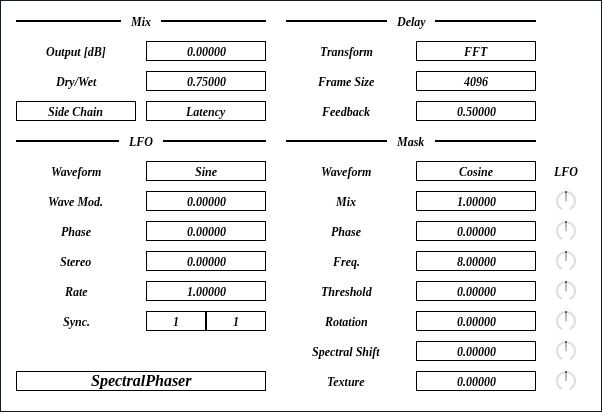
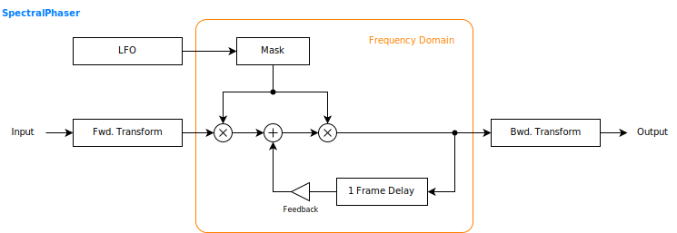

---
lang: en
...

# SpectralPhaser

SpectralPhaser is an effect that produces a phaser-like sound by applying a mask in the frequency domain. In addition to FFT, fast Walsh-Hadamard transform (FWHT) and Haar transform are available.


- [Download SpectralPhaser {{ latest_version["SpectralPhaser"] }} `{{ target }}` - VST 3 (github.com)]({{ download_url }}) 


- [Download Presets (github.com)]({{ preset_download_url["SpectralPhaser"] }})


**Note**: Presets produce the expected sound only if the sampling rate is 48000 Hz.

{{ section["package"] }}

{{ section["contact_installation_guiconfig"] }}

## Controls
{{ section["gui_common"] }}

{{ section["gui_knob"] }}

## Block Diagram
If the image is small, use <kbd>Ctrl</kbd> + <kbd>Mouse Wheel</kbd> or "View Image" on right click menu to scale.

Diagram only shows overview. It's not exact implementation.

## Parameters
Characters inside of square brackets \[\] represents unit. Following is a list of units used in SpectralPhaser.

- \[dB\] : Decibel.

### Mix
Output \[dB\]

:   Output gain.

Dry/Wet

:   Mixing ratio of input and effect output.

    0 is input only, 1 is effect output only.

Side Chain

:   When enabled, the sidechain input is used for frequency masking.

    SpectralPhaser could be used as a vocoder when both `Side Chain` and `Latency` are enabled. In this case, set `Frame Size` to around 2048. If `Frame Size` is small, the effect will be weaker.

    The vocoder mode is not suitable for real-time use because latency is high.

Latency

:   When enabled, `Frame Size` will be used as latency in samples.

### LFO
Waveform

:   LFO waveform.

Wave Mod.

:   LFO waveform modifier.

Phase

:   Initial phase of LFO.

Stereo

:   Phase offset of LFOs between left and right channels.

Rate

:   LFO frequency multiplier.

    This can be useful to slightly shift the tempo sync timing.

Sync.

:   Interval of LFO tempo synchronization.

    2 numbers corresponds to the numerals in time signatur. (`left/right` = `upper/lower`).

    - Left number correspond to upper numeral of time signature.
    - Right number correspond to lower numeral of time signature

    The plugin receives musical time as beats, where a beat has a relative length depending on the time signature. Here are some examples:

    - 1 / 1 synchronizes to 1 bar.
    - 1 / 4 synchronizes to 1 beat (a quarter note), when time signature is N / 4.
    - 1 / 6 synchronizes to 1 beat, when time signature is N / 6.
    - 3 / 16  synchronizes to 3 / 4 beat (a dotted 8th note), when time signature is N / 4.

    When time signature is changed, there may be a momentary loss of sync immediately after the change.

### Delay
Transform

:   Type of time to frequency transformation.

    FFT is the normal choice, FWHT and Haar will sound rough.

    **Attention**: Changing `Transform` stops the sound for duration of `Frame Size`. This is because the buffer is reset to avoid loud bursts.

Frame Size

:   Length of a frame over which a transform is performed.

    `Frame Size` also represents delay time in samples.

    When `Latency` is enabled, `Frame Size` will be used as latency in samples.

    When `Frame Size` is large and DAW buffer size is small, the sound may stutter. In this case, reduce `Frame Size` to reduce CPU load.

Feedback

:   Feedback gain of delay.

### Mask
LFO modulation can be changed by the small knobs on right side of parameter value.

Waveform

:   Waveform of frequency mask.

Mix

:   Mixing ratio of frequency mask.

    0 means no masking, 1 means full masking.

Phase

:   Phase of the frequency mask waveform.

    Modulating `Phase` with an LFO produces a sound similar to a phaser.

Freq.

:   Frequency of frequency mask waveform.

    Higher the `Freq.`, more notches.

    Setting `Freq.` to 0 disables frequency masking.

    When `Waveform` is Noise, there is no waveform frequency, so instead the random seed value is changed.

Threshold

:   When a value in a frequency mask is less than `Threshold`, the corresponding frequency is set to zero.

Rotation

:   Amount of phase rotation in the frequency domain.

    This only applies when `Transform` is FFT; when other orthogonal transforms are selected, `Rotation` is used as an amount to swap frequency components.

Spectral Shift

:   Frequency shift amount for each feedback.

Texture

:   Scaling that changes the location of the notches in the frequency mask.

    When `Waveform` is Noise, the frequency mask is smoothed by applying a low-pass filter.

## Change Log

- {{version}}
  
  - {{ log }}
  


## Old Versions

N/A.

  
- [SpectralPhaser {{ x["version"] }} - VST 3 (github.com)]({{ x["url"] }})
  


## License
SpectralPhaser is licensed under GPLv3. Complete licenses are linked below.

- [https://github.com/ryukau/VSTPlugins/tree/master/License](https://github.com/ryukau/VSTPlugins/tree/master/License)

If the link above doesn't work, please send email to `ryukau@gmail.com`.

### About VST
VST is a trademark of Steinberg Media Technologies GmbH, registered in Europe and other countries.
