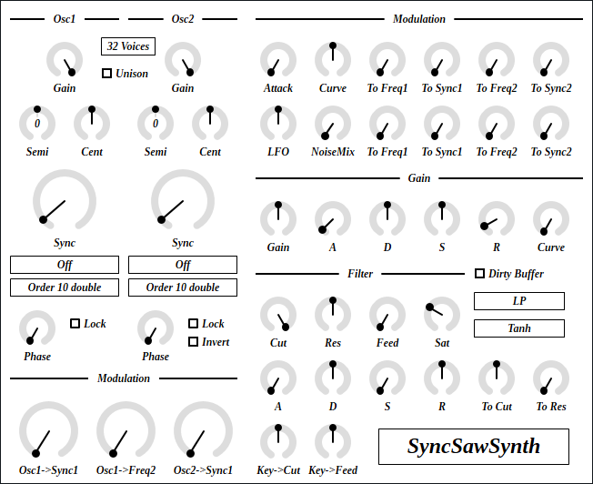

---
lang: ja
...

# SyncSawSynth


<ruby>SyncSawSynth<rt>シンク ソウ シンセ</rt></ruby> は10次までのPTR鋸歯波オシレータが使える32ボイスのポリフォニックシンセサイザです。主にハードシンクと周波数変調で電池が切れかけのおもちゃのような音を作る用途に向いています。もちろん普通の音も出ます。


- [SyncSawSynth {{ latest_version["SyncSawSynth"] }} `{{ target }}` - VST 3 をダウンロード (github.com)]({{ download_url }}) 


- [プリセットをダウンロード (github.com)]({{ preset_download_url["SyncSawSynth"] }})


{{ section["package"] }}

{{ section["contact_installation_guiconfig"] }}

## 操作
{{ section["gui_common"] }}

{{ section["gui_knob"] }}

## 注意
アタックの長さによって音量エンベロープのピーク値が変わります。音量エンベロープのアタックが小さいとき、ピークは通常より少し高くなることがあります。

Dirty Filter にチェックを入れるとノートオンによってプチノイズが出ることがあります。

パラメータの組み合わせによっては直流信号が乗るときがあります。ディストーションなどをかけると面白い音になることがあるので、直流は切っていません。安全のためには SyncSawSynth の後にハイパスフィルタを通すことが望ましいです。またオシロスコープで出力を監視することをお勧めします。

## ブロック線図
図が小さいときはブラウザのショートカット <kbd>Ctrl</kbd> + <kbd>マウスホイール</kbd> や、右クリックから「画像だけを表示」などで拡大できます。

図で示されているのは大まかな信号の流れです。実装と厳密に対応しているわけではないので注意してください。


## 用語について
SyncSawSynth のオシレータは内部に 2 つのオシレータを持っています。 1 つは波形生成のために使われ、もう 1 つはハードシンクをトリガするために使われています。ハードシンクに関する用語として、波形生成のためのオシレータのことをスレーブ、トリガに使われるオシレータのことをマスタと呼んでいます。

## パラメータ
### Osc
Gain

:   オシレータの音量。範囲は 0.0 から 1.0 。

Semi

:   オシレータのピッチ。範囲は -24.0 から 24.0 。単位は半音。

    値は `floor` 関数で整数に丸められます。例えば 6.3 なら 6 、 -11.5 なら -12 になります。

Cent

:   オシレータのピッチ。範囲は -100.0 から 100.0 。単位はセント。

Sync と SyncType

:   `Sync` の値は `SyncType` の値によって意味が変わります。 `Sync` の値の範囲は 0.01 から 16.0 です。

    `SyncType` は次の4つから選択できます。

    - `Off`
    - `Ratio`
    - `Fixed-Master`
    - `Fixed-Slave`

    `Off` を選ぶとマスタ周波数を 0 Hz にすることでハードシンクを無効にします。ただし `Modulation` の `Osc*->Sync1` が 0 より大きいときはマスタ位相が動くのでハードシンクがかかることがあります。 `SyncType` が `Off` のときは、 `Sync` の値は使われません。

    `Ratio` を選ぶと音程をマスタ周波数に使います。スレーブ周波数はマスタ周波数に `Sync` の値をかけ合わせた値になります。また `Ratio` のときだけ `To Freq/Sync` の変調先が入れ替わります。

    `Fixed-Master` を選ぶと音程をスレーブ周波数に使います。マスタ周波数は `Sync` の値のみによって決まります。

    `Fixed-Slave` を選ぶと音程をマスタ周波数に使います。スレーブ周波数は `Sync` の値のみによって決まります。

    `Fixed-Master` と `Fixed-Slave` で使われる `Sync` の値を周波数に変換する式は次の通りです。

    ```
    frequency = 2 * Sync^3
    ```

OscType

:   オシレータの波形。

    0 から 10 次までの PTR 鋸歯波オシレータとサイン波が選べます。

Phase

:   オシレータの位相。範囲は 0.0 から 1.0 。

    `Lock` にチェックを入れるとノートオンのたびに位相がリセットされます。

    `Osc2` の `Invert` にチェックを入れると、 `Osc2` の出力の正負の符号を変えることで位相を反転します。

Unison

:   チェックを入れるとノートごとに位相の異なる同じ高さの音を重ねます。CPU負荷も2倍になります。

Number of Voice

:   最大同時発音数。この値を減らすとCPU負荷を減らすことができます。

### Modulation
Osc1->Sync1

:   `Osc1` の出力による `Osc1` のマスタ周波数の変調。範囲は 0.0 から 1.0 。

Osc1->Freq2

:   `Osc1` の出力による `Osc2` のスレーブ周波数の変調。範囲は 0.0 から 1.0 。

Osc2->Sync1

:   `Osc2` の出力による `Osc1` のマスタ周波数の変調。範囲は 0.0 から 1.0 。

Attack

:   変調用の AD エンベロープのアタック。範囲は 0.0 から 4.0 。単位は秒。

    AD エンベロープの式です。

    ```
    env(t) := t^a * exp(-b * t)

    t: 時間。
    a, b: 適当な定数。
    ```

Curve

:   変調用の AD エンベロープの特性。範囲は 1.0 から 96.0 。

    `Curve` の値に応じてディケイの長さが決まります。

To Freq1 (AD エンベロープ)

:   AD エンベロープによる `Osc1` のスレーブ周波数の変調。範囲は 0.0 から 16.0 。

To Sync1 (AD エンベロープ)

:   AD エンベロープによる `Osc1` のマスタ周波数の変調。範囲は 0.0 から 16.0 。

To Freq2 (AD エンベロープ)

:   AD エンベロープによる `Osc２` のスレーブ周波数の変調。範囲は 0.0 から 16.0 。

To Sync2 (AD エンベロープ)

:   AD エンベロープによる `Osc２` のマスタ周波数の変調。範囲は 0.0 から 16.0 。

LFO

:   LFO の周波数。範囲は 0.01 から 20.0 。単位は Hz 。

NoiseMix

:   LFO とピンクノイズのミックスの比率。範囲は 0.0 から 1.0 。

    値が 0.0 のときに LFO のみ、 1.0 のときにピンクノイズのみになります。

    ピンクノイズによる変調はスパイクを生じることがあるので注意してください。スパイクを避けるには `To Sync/Freq` の値を 1.0 より小さく設定してください。スパイクは0dBを超えないようにクリップされています。

To Freq1 (LFO/ノイズ)

:   LFO/ノイズによる `Osc1` のスレーブ周波数の変調。範囲は 0.0 から 16.0 。

To Sync1 (LFO/ノイズ)

:   LFO/ノイズによる `Osc1` のマスタ周波数の変調。範囲は 0.0 から 16.0 。

To Freq2 (LFO/ノイズ)

:   LFO/ノイズによる `Osc２` のスレーブ周波数の変調。範囲は 0.0 から 16.0 。

To Sync2 (LFO/ノイズ)

:   LFO/ノイズによる `Osc２` のマスタ周波数の変調。範囲は 0.0 から 16.0 。

### Gain
Gain

:   シンセサイザの出力音量。範囲は 0.0 から 1.0 。

A

:   音量エンベロープのアタックの長さ。範囲は 0.0001 から 16.0 。単位は秒。

D

:   音量エンベロープのディケイの長さ。範囲は 0.0001 から 16.0 。単位は秒。

S

:   音量エンベロープのサステインの大きさ。範囲は 0.0 から 1.0 。

R

:   音量エンベロープのリリースの長さ。範囲は 0.0001 から 16.0 。単位は秒。

Curve

:   音量エンベロープの特性。範囲は 0.0 から 1.0 。

    素の音量エンベロープと tanh によって飽和させたエンベロープとを線形補間しています。

    ```
    gainEnv(t) := expEnv(t) * (tanh(3 * Curve * expEnv(t)) - expEnv(t))
    ```

### Filter
Cut

:   フィルタのカットオフ周波数。範囲は 20.0 から 20000.0 。単位は Hz 。

Res

:   2 次フィルタのレゾナンス。範囲は 0.001 から 1.0 。

    値を最小にすると音量がかなり小さくなります。

Feed

:   フィルタセクションのフィードバック。範囲は 0.0 から 1.0 。

    直列につないだ 4 つの 2 次フィルタの出力を 1 つ目のフィルタにフィードバックしています。

Sat

:   フィルタのサチュレーション。範囲は 0.01 から 8.0 。

    フィードバックと入力を足し合わせた値をウェーブシェーパに入力するときにかけ合わせる値です。

    ```
    filterIn = shaper(Sat * (input - Feed * filterOut))
    ```

Dirty Buffer

:   チェックを外すとノートオンのたびにフィルタのバッファをクリアします。

    チェックを入れている間はノートオンのたびに音の始まりにプチノイズが乗ることがあります。

FilterType

:   フィルタの種類。

    - `LP` : ローパス
    - `HP` : ハイパス
    - `BP` : バンドパス
    - `Notch` : ノッチ (バンドストップ)
    - `Bypass` : フィルタの迂回

ShaperType

:   フィルタのサチュレーションに使うウェーブシェーパの種類。

    ```
    HardClip(x) := clamp(x, -1.0, 1.0)
    Tanh(x)     := tanh(x)
    ShaperA(x)  := sin(2 * pi * x) / (1 + 10 * x * x)
    ShaperB(x)  := 0.7439087749328765 * x^3 * exp(-abs(x))
    ```

A

:   フィルタエンベロープのアタックの長さ。範囲は 0.0001 から 16.0 。単位は秒。

D

:   フィルタエンベロープのディケイの長さ。範囲は 0.0001 から 16.0 。単位は秒。

S

:   フィルタエンベロープのサステインの大きさ。範囲は 0.0 から 1.0 。

R

:   フィルタエンベロープのリリースの長さ。範囲は 0.0001 から 16.0 。単位は秒。

To Cut

:   フィルタエンベロープによるカットオフ周波数の変調。範囲は -1.0 から 1.0 。

To Res

:   フィルタエンベロープによるレゾナンスの変調。範囲は 0.0 から 1.0 。

Key->Cut

:   ノートの MIDI ノート番号によるカットオフ周波数の変調。範囲は -1.0 から 1.0 。

Key->Feed

:   ノートの MIDI ノート番号によるフィードバックの変調。範囲は -1.0 から 1.0 。

## チェンジログ

- {{version}}
  
  - {{ log }}
  


## 旧バージョン

旧バージョンはありません。

  
- [SyncSawSynth {{ x["version"] }} - VST 3 (github.com)]({{ x["url"] }})
  


## ライセンス
SyncSawSynth のライセンスは GPLv3 です。 GPLv3 の詳細と、利用したライブラリのライセンスは次のリンクにまとめています。

- [https://github.com/ryukau/VSTPlugins/tree/master/License](https://github.com/ryukau/VSTPlugins/tree/master/License)

リンクが切れているときは `ryukau@gmail.com` にメールを送ってください。

### VST® について
VST is a trademark of Steinberg Media Technologies GmbH, registered in Europe and other countries.
