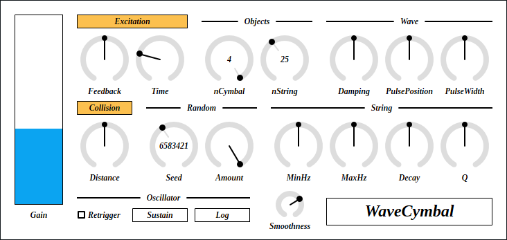

---
lang: ja
...

# WaveCymbal


<ruby>WaveCymbal<rt>ウェイブ シンバル</rt></ruby> は banded wave-guide という手法を用いてシンバルの音が鳴るはずだったシンセサイザです。実際のところはシンバルというよりも、アスファルトの上でトタン板や紐につないだ空き缶を引きずったときのような音が出ます。

- [WaveCymbal 0.1.19 をダウンロード - VST® 3 (github.com)](https://github.com/ryukau/VSTPlugins/releases/download/UhhyouPlugins0.34.0/WaveCymbal_0.1.19.zip) 
- [プリセットをダウンロード (github.com)](https://github.com/ryukau/VSTPlugins/releases/download/LinuxGUIFix/WaveCymbalPresets.zip)

パッケージには次のビルドが含まれています。

- Windows 64bit
- Linux 64bit
- macOS universal binary

Linux ビルドは Ubuntu 20.04 でビルドしています。もし Ubuntu 20.04 以外のディストリビューションを使っているときは、プラグインが読み込まれないなどの不具合が起こることがあります。この場合は[ビルド手順](https://github.com/ryukau/VSTPlugins/blob/master/build_instruction.md)に沿ってソースコードからビルドしてください。

## 連絡先
何かあれば [GitHub のリポジトリ](https://github.com/ryukau/VSTPlugins)に issue を作るか `ryukau@gmail.com` までお気軽にどうぞ。

[paypal.me/ryukau](https://www.paypal.com/paypalme/ryukau) から開発資金を投げ銭することもできます。現在の目標はよりよい macOS サポートのための M1 mac の購入資金を作ることです。 💸💻

## インストール
### プラグイン
名前が `.vst3` で終わるディレクトリを OS ごとに決められた位置に配置してください。

- Windows では `/Program Files/Common Files/VST3/` に配置します。
- Linux では `$HOME/.vst3/` に配置します。
- macOS では `/Users/$USERNAME/Library/Audio/Plug-ins/VST3/` に配置します。

DAW によっては上記とは別に VST3 をインストールできるディレクトリを提供していることがあります。詳しくは利用している DAW のマニュアルを参照してください。

### プリセット
解凍して出てきたディレクトリを OS ごとに決められた位置に配置すると使えるようになります。

- Windows : `/Users/$USERNAME/Documents/VST3 Presets/Uhhyou`
- Linux : `$HOME/.vst3/presets/Uhhyou`
- macOS : `/Users/$USERNAME/Library/Audio/Presets/Uhhyou`

プリセットディレクトリの名前はプラグインと同じである必要があります。 `Uhhyou` ディレクトリが無いときは作成してください。

### Windows
プラグインが DAW に認識されないときは C++ redistributable をインストールしてみてください。インストーラは次のリンクからダウンロードできます。ファイル名は `vc_redist.x64.exe` です。

- [The latest supported Visual C++ downloads](https://support.microsoft.com/en-us/help/2977003/the-latest-supported-visual-c-downloads)

### Linux
Ubuntu 18.0.4 では次のパッケージのインストールが必要です。

```bash
sudo apt install libxcb-cursor0  libxkbcommon-x11-0
```

もし DAW がプラグインを認識しないときは、下のリンクの `Package Requirements` を参考にして VST3 に必要なパッケージがすべてインストールされているか確認してください。

- [VSTGUI: Setup](https://steinbergmedia.github.io/vst3_doc/vstgui/html/page_setup.html)

REAPER の Linux 版がプラグインを認識しないときは `~/.config/REAPER/reaper-vstplugins64.ini` を削除して REAPER を再起動してみてください。

### macOS
**注意**: この節は英語で macOS を使用しているユーザからの報告によって作成されました。日本語でのエラーメッセージが分からなかったので曖昧な書き方になっています。

プラグインの初回起動時に「破損している」という趣旨のメッセージが表示されることがあります。この場合は、ターミナルを開いて、解凍した `.vst3` ディレクトリに次のコマンドを適用してみてください。

```sh
xattr -rc /path/to/PluginName.vst3
```

プラグインは署名されていない (unsigned) 、または公証されていない (un-notarized) アプリケーションとして認識されることがあります。この場合は以下の手順を試してみてください。

1. ターミナルを開いて `sudo spctl --master-disable` を実行。
2. システム環境設定 → セキュリティとプライバシー → 一般 → ダウンロードしたアプリケーションの実行許可、を開いて 「全てのアプリケーションを許可」 を選択。

上記の手順を実行するとシステムのセキュリティが弱くなるので注意してください。元に戻すには以下の手順を実行してください。

1. システム環境設定 → セキュリティとプライバシー → 一般 → ダウンロードしたアプリケーションの実行許可、を開いて 「App Store と認証済みの開発元からのアプリケーションを許可」 を選択。
2. ターミナルを開いて `sudo spctl --master-enable` を実行。

#### 参考リンク
- [How to Fix App “is damaged and can’t be opened. You should move it to the Trash” Error on Mac](https://osxdaily.com/2019/02/13/fix-app-damaged-cant-be-opened-trash-error-mac/)
- [Allowing unsigned/un-notarized applications/plugins in Mac OS | Venn Audio](https://www.vennaudio.com/allowing-unsigned-un-notarized-applications-plugins-in-mac-os/)
- [Safely open apps on your Mac - Apple Support](https://support.apple.com/en-us/HT202491)

## GUI の見た目の設定
初回設定時は手動で次のファイルを作成してください。

- Windows では `/Users/ユーザ名/AppData/Roaming/UhhyouPlugins/style/style.json` 。
- Linux では `$XDG_CONFIG_HOME/UhhyouPlugins/style/style.json` 。
  - `$XDG_CONFIG_HOME` が空のときは `$HOME/.config/UhhyouPlugins/style/style.json` 。
- macOS では `/Users/$USERNAME/Library/Preferences/UhhyouPlugins/style/style.json` 。

既存の色のテーマを次のリンクに掲載しています。 `style.json` にコピペして使ってください。

- [LV2Plugins/style/themes at master · ryukau/LV2Plugins · GitHub](https://github.com/ryukau/LV2Plugins/tree/master/style/themes)

`style.json` の設定例です。

```json
{
  "fontFamily": "Tinos",
  "fontBold": true,
  "fontItalic": true,
  "foreground": "#000000",
  "foregroundButtonOn": "#000000",
  "foregroundInactive": "#8a8a8a",
  "background": "#ffffff",
  "boxBackground": "#ffffff",
  "border": "#000000",
  "borderCheckbox": "#000000",
  "borderLabel": "#000000",
  "unfocused": "#dddddd",
  "highlightMain": "#0ba4f1",
  "highlightAccent": "#13c136",
  "highlightButton": "#fcc04f",
  "highlightWarning": "#fc8080",
  "overlay": "#00000088",
  "overlayHighlight": "#00ff0033"
}
```

### フォントオプション
以下はフォントオプションの一覧です。

- `fontFamily`: フォントファミリ名。
- `fontBold`: ボールドスタイル (太字) を `true` で有効、 `false` で無効。
- `fontItalic`: イタリックスタイル (斜体) を `true` で有効、 `false` で無効。

カスタムフォントを使用するには、プラグインディレクトリの `*.vst3/Contents/Resources/Fonts` に `*.ttf` ファイルを配置します。

**注意**: `fontFamily` 、 `fontBold` 、 `fontItalic` で設定したフォントファミリ名とスタイルの組み合わせが `*.vst3/Contents/Resources/Fonts` 以下のいずれかの `*.ttf` ファイルに含まれていないときは VSTGUI が指定するデフォルトフォントが使用されます。

`fontFamily` が長さ 0 の文字列 `""` のときはフォールバックとして [`"Tinos"`](https://fonts.google.com/specimen/Tinos) に設定されます。長さが 1 以上かつ、存在しないフォントファミリ名が指定されると VSTGUI が指定するデフォルトフォントが使用されます。

ボールドあるいはイタリック以外のスタイルは VSTGUI がサポートしていないので動作確認していません。該当する例としては Noto フォントの Demi Light や、 Roboto フォントの Thin や Black などがあります。

### 色のオプション
16 進数カラーコードを使っています。

- 6 桁の色は RGB 。
- 8 桁の色は RGBA 。

プラグインはカラーコードの 1 文字目を無視します。よって `?102938` や `\n11335577` も有効なカラーコードです。

2 文字目以降のカラーコードの値に `0-9a-f` 以外の文字を使わないでください。

以下は設定できる色の一覧です。設定に抜けがあるとデフォルトの色が使われます。

- `foreground`: 文字の色。
- `foregroundButtonOn`: オンになっているボタンの文字の色。 `foreground` か `boxBackground` のいずれかと同じ値にすることを推奨します。
- `foregroundInactive`: 非アクティブなタブの文字の色。
- `background`: 背景色。
- `boxBackground`: 矩形の UI 部品の内側の背景色。
- `border`: <ruby>縁<rt>ふち</rt></ruby>の色。
- `borderCheckbox`: チェックボックスの縁の色。
- `borderLabel`: パラメータセクションのラベルの左右の直線の色。
- `unfocused`: つまみがフォーカスされていないときの色。
- `highlightMain`: フォーカスされたときの色。スライダの値の表示にも使用されます。
- `highlightAccent`: フォーカスされたときの色。一部のプラグインをカラフルにするために使用されます。
- `highlightButton`: ボタンがフォーカスされたときの色。
- `highlightWarning`: 変更に注意を要する UI がフォーカスされたときの色。
- `overlay`: オーバーレイの色。
- `overlayHighlight`: フォーカスを示すオーバーレイの色。

## 操作
つまみとスライダーでは次の操作ができます。

- Ctrl + 左クリック : 値のリセット。
- Shift + 左ドラッグ : 細かい値の変更。

操作できる箇所を右クリックすると DAW によって提供されているコンテキストメニューを開くことができます。

## 注意
マウスカーソルを合わせたときに赤くハイライトされるパラメータは音量を大きく変えることができます。これらのパラメータは Shift + 左ドラッグを使ってゆっくりと変更することを推奨します。また突然の音割れを防ぐために、WaveCymbaの後には必ずリミッタをインサートすることを推奨します。

## ブロック線図
図が小さいときはブラウザのショートカット <kbd>Ctrl</kbd> + <kbd>マウスホイール</kbd> や、右クリックから「画像だけを表示」などで拡大できます。

図で示されているのは大まかな信号の流れです。実装と厳密に対応しているわけではないので注意してください。


## パラメータ
### Gain
出力音量です。

### Excitation
インパルスをトーンに変えるショートディレイです。

Feedback

:   エキサイタのショートディレイのフィードバックです。

Time

:   エキサイタのショートディレイのディレイ時間です。この値が大きくなると音量がとても大きくなるので注意してください。

### Objects
nCymbal

:   シンバルの枚数を表現するはずだった値です。シンバルとは程遠い何らかのシミュレーションのオブジェクトが増えます。

nString

:   シンバル1枚あたりのシミュレーションの解像度を表現するはずだった値です。 Karplus-Strong アルゴリズムによる弦の数を変更できます。

### Wave
1次元の波のシミュレーションです。

Damping

:   波のダンピングを変更します。この値が大きくなると音量がとても大きくなるので注意してください。

PulsePosition

:   オシレータの出力が波を起こす位置です。

PulseWidth

:   オシレータの出力によって起こされる波の幅です。

### Collision
シンバルを衝突させてハイハットのような音になるはずでした。オンにすると軽い金属が擦れるようなノイズが出ます。 `nCymbal` が 1 のときは効果がありません。

Distance

:   シンバルの間隔です。左に回すほど間隔が狭くなるので、衝突の可能性が増えます。

### Random
Seed

:   乱数のシード値です。 `Retrigger` にチェックを入れることで音を固定できます。

Amount

:   乱数の影響を調整します。この値が小さくなると音量がとても大きくなることがあるので注意してください。

### String
MinHz

:   Karplus-Strong アルゴリズムによる弦の周波数の範囲の下限です。

MaxHz

:   Karplus-Strong アルゴリズムによる弦の周波数の範囲の上限です。

Decay

:   Karplus-Strong アルゴリズムによる弦の減衰の速さを調整します。左に回すほど減衰が遅くなります。

Q

:   バンドパスフィルタの Q 値（レゾナンス）です。右に回すほど Q が大きくなります。

### Oscillator
Retrigger

:   チェックが入っているときはノートオンのたびに乱数シードをリセットします。

OscType

:   オシレータの種類です。

    - `Off` : ノートオンに反応しなくなります。エフェクトとして使うときに利用できます。
    - `Impulse` : ノートオンでインパルスを出力します。ばちで叩いたときのような音を想定しています。
    - `Sustain` : ノートに応じた高さのインパルス列を出力します。バイオリンの弓のようなもので擦ったときのような音を想定しています。
    - `Velvet Noise` : ノートに応じた密度のベルベットノイズを出力します。 `Sustain` よりも不均一にシンバルを擦ったときのような音を想定しています。
    - `Brown Noise` : ノートに応じた明るさのブラウンノイズを出力します。`Velvet Noise` よりも不均一に擦ったときのような音を想定しています。

Bandpass Cutoff Distribution

:   バンドパスフィルタのカットオフ周波数の分布を変更します。

    - `Log` : 低域寄りの比較的自然な音になります。
    - `Linear` : 高域寄りのとげとげしい音になります。

### Smoothness
`Gain`, `Excitation.Time`, `Random.Amount`, `Bandpass.MinCutoff`, `Bandpass.MaxCutoff` を変更したときに、変更前の値から変更後の値に移行する時間（秒）です。 `OscType.Sustain` のスライドの長さも `Smoothness` で調整できます。

## チェンジログ
- 0.1.19
  - macOS ビルドを復帰。
- 0.1.18
  - Linux でのクラッシュを修正。
- 0.1.17
  - プラグインが許可するチャネル数の条件を修正。この修正は REAPER のサイドチェインで意図しないミュートがかかることを防ぐために行った。
- 0.1.16
  - `style.json` でカスタムフォントを設定するオプションを追加。
- 0.1.15
  - VSTGUI を 4.10 から 4.11 にアップデート。
- 0.1.14
  - フォントを Tinos に変更。
- 0.1.13
  - リセットが正しく行われるように修正。
  - `bypass` パラメータの挙動を修正。この修正によって、ホストがミュート中のプラグインにノートを送り続けても、ミュート解除とともにそれまでに送られたノートがすべて再生されなくなった。このバグは VST 3 の `bypass` パラメータを正しく実装しているホストでのみ発生していた。
- 0.1.12
  - Process context requirements を実装。
- 0.1.11
  - DSP が初期化されているかどうかのチェックを追加。
- 0.1.10
  - カラーコンフィグを追加。
- 0.1.9
  - パラメータの補間を可変サイズのオーディオバッファでも機能する以前の手法に巻き戻した。
- 0.1.8
  - 文字列の描画でクラッシュするバグを修正。
- 0.1.7
  - プラグインタイトルをクリックすると表示されるポップアップの表示方法の変更。
- 0.1.6
  - 非アクティブ化で音が止まるように修正。
  - PreSonus Studio One 4.6.1 で出力にノイズが乗るバグを修正。
- 0.1.5
  - Linux ビルドの GUI を有効化。
  - 読み込めないプリセットを修正。
- 0.1.4
  - Ableton Live 10.1.6 で特定のノブが揺れ戻るバグを修正。
- 0.1.3
  - 複数の GUI インスタンス間で表示を同期するように変更。
  - スプラッシュスクリーンを開くとクラッシュするバグを修正。
  - リロード時にクラッシュするバグを修正。
  - GUI がホストのオートメーションに応じて更新されるように修正。
- 0.1.2
  - ノートオン・オフが正確なタイミングでトリガされるように修正。
- 0.1.1
  - スムーシングのアルゴリズムの値が決められた範囲を超えるバグを修正。
- 0.1.0
  - 初期リリース。

## 旧バージョン
- [WaveCymbal 0.1.18 - VST 3 (github.com)](https://github.com/ryukau/VSTPlugins/releases/download/UhhyouPlugins0.33.0/WaveCymbal_0.1.18.zip)
- [WaveCymbal 0.1.17 - VST 3 (github.com)](https://github.com/ryukau/VSTPlugins/releases/download/UhhyouPlugins_0_31_0/WaveCymbal_0.1.17.zip)
- [WaveCymbal 0.1.16 - VST 3 (github.com)](https://github.com/ryukau/VSTPlugins/releases/download/CustomFontOptions/WaveCymbal_0.1.16.zip)
- [WaveCymbal 0.1.14 - VST 3 (github.com)](https://github.com/ryukau/VSTPlugins/releases/download/BasicLimiterAndFDN64Reverb/WaveCymbal_0.1.14.zip)
- [WaveCymbal 0.1.13 - VST 3 (github.com)](https://github.com/ryukau/VSTPlugins/releases/download/ResetAndMuteFix/WaveCymbal_0.1.13.zip)
- [WaveCymbal 0.1.12 - VST 3 (github.com)](https://github.com/ryukau/VSTPlugins/releases/download/CollidingCombSynth0.1.0/WaveCymbal0.1.12.zip)
- [WaveCymbal 0.1.11 - VST 3 (github.com)](https://github.com/ryukau/VSTPlugins/releases/download/L3Reverb0.1.0/WaveCymbal0.1.11.zip)
- [WaveCymbal 0.1.10 - VST 3 (github.com)](https://github.com/ryukau/VSTPlugins/releases/download/ColorConfig/WaveCymbal0.1.10.zip)
- [WaveCymbal 0.1.9 - VST 3 (github.com)](https://github.com/ryukau/VSTPlugins/releases/download/LatticeReverb0.1.0/WaveCymbal0.1.9.zip)
- [WaveCymbal 0.1.8 - VST 3 (github.com)](https://github.com/ryukau/VSTPlugins/releases/download/DrawStringFix/WaveCymbal0.1.8.zip)
- [WaveCymbal 0.1.6 - VST 3 (github.com)](https://github.com/ryukau/VSTPlugins/releases/download/EsPhaser0.1.0/WaveCymbal0.1.6.zip)
- [WaveCymbal 0.1.5 - VST 3 (github.com)](https://github.com/ryukau/VSTPlugins/releases/download/LinuxGUIFix/WaveCymbal0.1.5.zip)
- [WaveCymbal 0.1.4 - VST 3 (github.com)](https://github.com/ryukau/VSTPlugins/releases/download/EnvelopedSine0.1.0/WaveCymbal0.1.4.zip)
- [WaveCymbal 0.1.3 - VST 3 (github.com)](https://github.com/ryukau/VSTPlugins/releases/download/IterativeSinCluster0.1.0/WaveCymbal0.1.3.zip)

## ライセンス
WaveCymbal のライセンスは GPLv3 です。 GPLv3 の詳細と、利用したライブラリのライセンスは次のリンクにまとめています。

- [https://github.com/ryukau/VSTPlugins/tree/master/License](https://github.com/ryukau/VSTPlugins/tree/master/License)

リンクが切れているときは `ryukau@gmail.com` にメールを送ってください。

### VST® について
VST is a trademark of Steinberg Media Technologies GmbH, registered in Europe and other countries.
